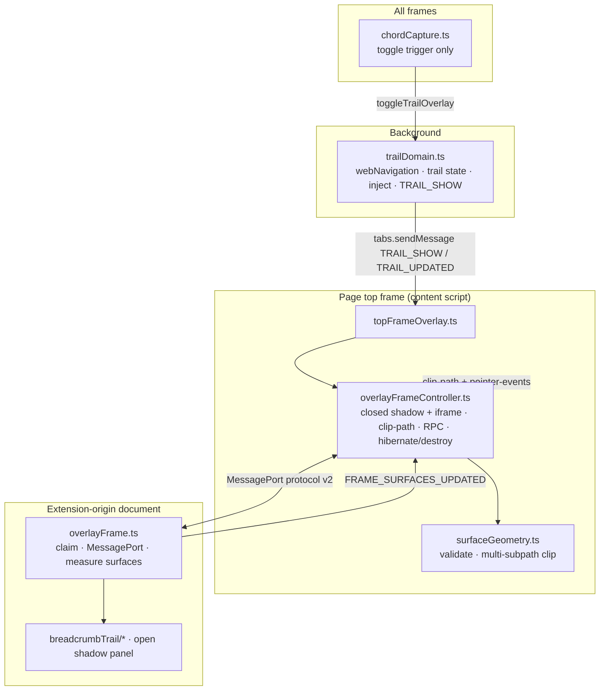
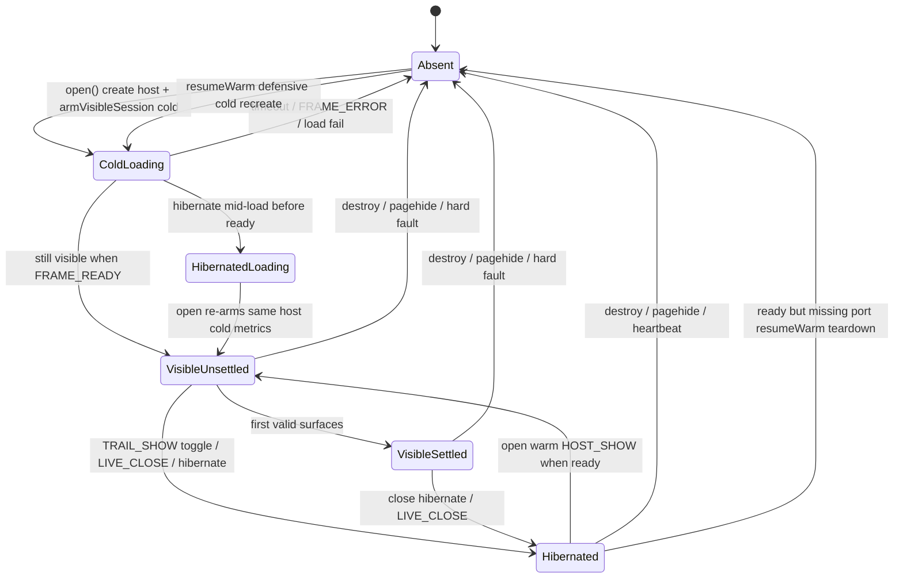
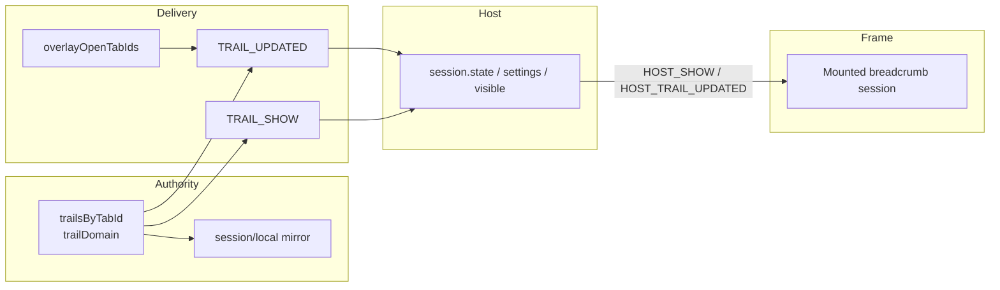

# TabTrail Overlay: Stability, Reliability & Performance Strategy

| Field | Value |
|-------|-------|
| **Author** | TabTrail maintainers |
| **Date** | 2026-07-12 |
| **Status** | Ready for implementation |
| **Scope** | Overlay two-document system (page host + extension frame + trail domain delivery) |
| **Related** | `OVERLAY_UI.md` (structure/reconstruction), this doc (SRE/ops quality of that architecture) |

---

## Overview

TabTrail’s product signature is a **non-modal, clip-through trail overlay**: a full-viewport extension-origin iframe is clipped to measured UI hit surfaces so the page remains interactive everywhere else. The implementation is already a deliberate two-document MessagePort protocol v2 system with warm hibernation, invalidation-driven geometry, and metadata-only live trail patches.

This document does **not** redesign the overlay UI or invent new layers. It recommends how to make that architecture as **stable**, **reliable**, and **performant** as practical for a Firefox/Chrome/Zen WebExtension—what to invest in, what patterns to standardize, what to avoid, measurable targets, observability, testing gaps, and an incremental PR plan.

**Proposed approach in one sentence:** treat the existing host/frame/domain split as the permanent spine; formalize its lifecycle and failure-class invariants; tighten race and state-consistency edges; keep cold/warm latency budgets honest with production-shaped browser tests; and invest observability in attribute-based diagnosis rather than chatty logs.

---

## Background & Motivation

### Current architecture (ground truth)



| Layer | Primary files | Responsibility |
|-------|---------------|----------------|
| Trail domain | `src/lib/backgroundRuntime/domains/trailDomain.ts` | Per-tab trail reducer, session mirror, inject (parallel chord+top), `TRAIL_SHOW` / `TRAIL_UPDATED` |
| Chord capture | `src/lib/appInit/chordCapture.ts` | Toggle trigger in **all** frames; no overlay host |
| Top overlay host | `src/lib/appInit/topFrameOverlay.ts` | `TRAIL_SHOW` toggle, claim nonce, settings, destroy on pagehide/hidden |
| Host controller | `src/lib/ui/overlayFrame/overlayFrameController.ts` | Iframe shell, clip, warm hibernate, heartbeat, RPC, latency attrs |
| Geometry | `src/lib/ui/overlayFrame/surfaceGeometry.ts` | Sequence validation, clamp, multi-subpath `clip-path` |
| Protocol | `src/lib/common/contracts/overlayFrame.ts` | v2 message/RPC map, max 32 surfaces |
| Frame | `src/entryPoints/overlayFrame/overlayFrame.ts` | Claim, mount, rAF geometry, observers |
| Panel UI | `src/lib/ui/panels/breadcrumbTrail/*` | Live bar, menus, library, notices; `patchLiveTrail` vs `renderBar` |

### Why investment is still needed

Recent review work already fixed high-value correctness edges (typed hibernate/destroy close, `HOST_INIT` marks initialized + settings only + `HOST_SHOW` paint, `armVisibleSession`, parallel injects, narrower geometry observers, metadata-only `patchLiveTrail`, long-lived mouse chord guard). Remaining risk is not “missing features” but **cross-boundary consistency under real browser pressure**:

1. **Three clocks of truth** — background trail map, host session state, frame-mounted DOM — can diverge during hibernate/show races, inject retries, and visibility teardown.
2. **Hit isolation is load-bearing** — a stale clip or empty-surface miss either blocks the page or leaves chrome unclickable; geometry is on the hot path of every layout change.
3. **Warm path is the default UX** — hibernate keeps iframe/port alive; bugs here feel like “random” cold reloads or stuck open state.
4. **Content-script lifecycle is hostile** — extension updates, bfcache, SPA navigations, private windows, and restricted URLs all stress reinjection and cleanup hooks (`__tabtrailTopCleanup` / `__tabtrailChordCleanup`).
5. **Latency is product-visible** — optional browser smoke already encodes budgets: cold host ≤ **250 ms**, warm host/toggle ≤ **50 ms** (`test/browser/overlay-precedence.mjs`). Note: browser smoke is **not** part of default `npm run ci` today.

### Pain points (operational)

| Pain | Symptom | Where it lives today |
|------|---------|----------------------|
| Soft vs hard failure ambiguity | One bad message kills session vs silent drop | Host soft-drops malformed frame msgs; frame hard-fails invalid host msgs; heartbeat / auth hard-teardown |
| Warm resume edge cases | Hibernate mid-load then reopen; ready without port; startup timeout | `open()` re-arm cold when `!ready`; `resumeWarm` only when `ready`; 3 s startup timeout |
| Mid-handshake second toggle | Second chord hibernates (not host-open idempotent) | `topFrameOverlay` `TRAIL_SHOW` when `isOpen()` |
| Geometry thrash / transitional union | Brief oversized hit region / white ghost on move | Stable moves publish current only; union+contract only on large resize |
| Trail patch vs rebuild | Full bar rebuild on cursor change; metadata patches otherwise | `canPatchLiveTrail` / `patchLiveTrail` (title-only path already tested) |
| Inject miss on toggle | First chord fails on pre-existing tab | `toggleOverlay` re-injects then retries `TRAIL_SHOW` (ladder tests exist) |
| Visibility destroy | Tab hide destroys warm host | `visibilitychange` + `pagehide` → destroy (not hibernate) |
| Diagnosis without logs | Hard to know cold vs warm failure / destroy reason after host remove | Host attrs while live; no stable last-fault API after teardown |

---

## Goals & Non-Goals

### Goals

1. **Stability** — process/lifecycle invariants that hold across inject, navigate, update, private windows, and browser quirks; soft failures do not cascade; hard failures recover to a clean cold open.
2. **Reliability** — trail domain, host session, and UI stay consistent; races (ready/hibernate/show/update) have explicit precedence; focus restore and geometry resync are deterministic.
3. **Performance** — meet and defend cold/warm open budgets; keep inject, geometry invalidation, and live-trail updates cheap; stay under bundle budgets.
4. **Observability** — measure the right latencies and failure classes; diagnose via host attributes and structured counters without noisy production logging.
5. **Test confidence** — close the **remaining** gaps that matter for SRE-quality regressions without reinventing already-green coverage.
6. **Incremental delivery** — strengthen existing modules; each change independently reviewable.

### Non-Goals

- Visual redesign, new design tokens, or interaction model changes (body = jump, ⋯ = menu remains).
- Cloud backends, accounts, multi-tab trail sync product features.
- Replacing the isolated extension iframe with pure in-page chrome (see Alternatives).
- Continuous rAF geometry sampling as the primary path (already abandoned for invalidation).
- Full always-cold open (would regress warm UX intentionally).
- Hibernating across tab hide / `pagehide` by default (see Alternative A7; **resolved: keep destroy**).
- Adding browser smoke to default `npm run ci` or Firefox cold-toggle budget as part of this strategy (**resolved: process-only smoke**).
- Debug builds / protocol log flags / `__TABTRAIL_DEBUG__` (**resolved: attrs + diagnostics only**).
- Rewriting `OVERLAY_UI.md` reconstruction phases; that guide stays authoritative for structure.
- Stopping heartbeat while hibernated (see §4.4 invariant).

---

## Key Decisions

| # | Decision | Rationale |
|---|----------|-----------|
| K1 | **Keep the two-document + MessagePort v2 architecture** | Isolation is the product (clip-through + page cannot cancel frame events). In-page-only would reintroduce CSS/event hostility. |
| K2 | **Warm hibernate remains the default close** | Toggle hide keeps iframe/port; cold open pays iframe load once. Warm budget (50 ms) is the user-facing path. |
| K3 | **Destroy on pagehide / visibility hidden / hard faults** | Warm host cannot outlive a dying browsing context; next open must be cold and clean. |
| K4 | **Asymmetric soft/hard boundary** — host soft-drops bad frame→host edges; frame hard-fails bad host→frame traffic; geometry soft-resync; auth/capability/heartbeat/`FRAME_ERROR` hard-destroy | One bad surface sequence must resync; host integrity failures must not limp along. |
| K5 | **Invalidation-driven geometry (rAF-coalesced), not continuous sampling** | Layout work only when DOM/viewport changes; transitional union + next-frame contraction prevents hit gaps. |
| K6 | **Metadata patch for live trail; full rebuild on structure/cursor** | Title/favicon churn is common; cursor/topology changes need correct interactive controls (div vs button). |
| K7 | **`HOST_INIT` marks frame initialized and applies settings; trail DOM mount and trail snapshot apply only on `HOST_SHOW`** | Single paint owner prevents double-mount and hibernate/show skew. Wire may still carry `state` on INIT for protocol symmetry; frame ignores it today—do not “fix” by mounting on INIT. |
| K8 | **Privileged work only via host RPC** | Frame never talks tabs/storage APIs; host/background own mutation and private-window policy. |
| K9 | **Sole observability surface: host DOM attributes while live + `getDiagnostics()` after teardown** | No debug channel, no protocol log flag, no production console spam. Attrs support browser smoke; diagnostics outlive `host.remove()`. |
| K10 | **Strengthen tests around remaining lifecycle races before adding new subsystems** | Highest ROI is untested race paths, not re-covering green patch/inject suites. |
| K11 | **Heartbeat continues through hibernate** | Liveness of the warm port must be detected even when `visible === false`; do not gate pings on `visible`. |
| K12 | **Metrics-first for geometry thrash; storm destroy is gated** | Default end state is counters/diagnostics (PR 5). Hard-destroy on resync rate only if a loop is reproduced or field-proven. |

---

## Proposed Design

### 1. Stability — lifecycle invariants and failure classes

#### 1.1 Process model (invariant table)

Formalize these as **must-not-regress** contracts (wiring tests + comments), matching code today:

| Invariant | Owner | Enforcement |
|-----------|-------|-------------|
| At most one host session per top frame | `overlayFrameController` | Single `session` ref (identity is reference equality, not a generation number) |
| `visible` ⇔ user-facing open | Controller `isOpen()` | `isOpen = session !== null && visible` — true as soon as `armVisibleSession`, **before** surfaces settle |
| Hibernate keeps host DOM + port; unmounts panel | `hibernate` / `HOST_HIBERNATE` | Empty surfaces + `hideFrameSurface` |
| Destroy removes host, closes port, unsubscribes | `teardown` | `pagehide`, faults, dispose, startup timeout |
| Claim nonce single-use | `authorizeClaim` | `claimed` latch |
| Sequence numbers reset on each visible arm | `armVisibleSession` | `lastSequence = null` |
| Paint only on `HOST_SHOW` | Frame `mountTrailUi` | `HOST_INIT` → `seedHostState` (settings + `initialized`); trail snapshot applied in `mountTrailUi` on SHOW |
| Chord capture does not own overlay | Split content scripts | Chord all frames; top host only |
| Heartbeat while ready (incl. hibernated) | Host interval | Runs when `ready`; independent of `visible` |
| Open attempt diagnostics | Host attrs | `nextOpenSequence` / `data-tabtrail-open-sequence` (separate from unused session `generation` field) |

**Note on `session.generation`:** assigned (`++nextGeneration`) on cold create but **never read** for event filtering. Async continuations use `session !== current` (closure-captured session object). Treat `generation` as dead/optional cleanup—not as a second identity mechanism. Do not invent generation-based filters that diverge from the ref check.



**Open path notes (match `open()` / `resumeWarm`):** cold create always arms visible immediately (`ColdLoading` is already visible-unsettled in practice). The only realistic `session && !ready && !visible` case is **hibernate mid-load** (`HibernatedLoading`). Reopen then reuses the host via `armVisibleSession(..., "cold")`—no teardown. `resumeWarm` is only entered when `ready === true`; its defensive `!ready || !port` teardown is effectively **ready && !port**.

#### 1.2 Soft vs hard failures (both directions)

The boundary is **intentionally asymmetric**.

| Direction | Class | Examples | Behavior | Recovery |
|-----------|-------|----------|----------|----------|
| Frame → host | **Soft / drop** | Malformed message (`!isOverlayFrameToHostMessage`); stale surface sequence; RPC id ≤ `lastRequestId` | Ignore | Continue session |
| Frame → host | **Soft / resync** | Viewport mismatch; invalid surface payload (non-stale) | `hideFrameSurface` + `HOST_REQUEST_SURFACES` | Next valid surfaces settle |
| Frame → host | **Hard / destroy** | Unexpected `FRAME_READY`, heartbeat miss ×3, `FRAME_ERROR`, clip-path unsupported, `messageerror`, startup timeout, unexpected reload | `teardown(reason)` | Next open is cold |
| Host → frame | **Hard / stop** | Invalid host message (`!isOverlayHostToFrameMessage`); RPC response method mismatch | `FRAME_ERROR` (when applicable) + `stopFrame` | Host sees error / missing pong → destroy |
| Page lifecycle | **Hard / destroy** | `pagehide`, `visibilityState === "hidden"`, content script cleanup | Destroy (not hibernate) | Reinjection on next navigate/toggle |

**Why the asymmetry:** host messages are extension-authored and should always be well-formed after claim; a corrupt host stream is a session integrity failure. Frame messages are still extension-origin after claim, but geometry/RPC edges can race or glitch—host prefers resync over teardown for those. Auth surprise and explicit `FRAME_ERROR` remain hard on the host.

**Recommendation:** document this **bidirectional** matrix next to `receiveFrameMessage` (host) **and** `receiveHostMessage` (frame). Prefer **resync over destroy** for geometry; prefer **destroy over limp-along** for auth and liveness. Do not upgrade soft geometry resync into hard destroy without evidence (see K12 / PR 6).

#### 1.3 Content-script reinjection

Current path is strong:

- Install/refresh: parallel `contentScriptChord.js` (all frames) + `contentScriptTop.js` (top); fallback combined `contentScript.js`.
- Retry delays `[400, 1200]` ms for failed / top-only outcomes.
- Toggle: if `TRAIL_SHOW` undelivered → inject → retry once.
- Cleanup hooks retire previous bootstrap on re-inject (`__tabtrailChordCleanup` / `__tabtrailTopCleanup`).

**Already covered (do not re-plan as greenfield):**

- Inject-on-`TRAIL_SHOW` miss + retry (`trail-domain-overlay-delivery.test.mjs`)
- Split chord+top files and combined `contentScript.js` fallback (same suite)
- Wiring that scripts are re-injection-safe at the source level (`runtime-wiring.test.mjs`)

**Remaining invest work:**

1. **Behavioral double-init stacking** — call `initChordCapture` / `initTopFrameOverlay` twice in jsdom and assert a single message listener / single controller (cleanup retirement is source-checked; behavioral stacking is the gap). Owned by **PR 7**.
2. **Toggle latency attribution** (low priority) — optional inject-on-toggle marker; host attrs already distinguish cold/warm kind.
3. **Avoid a third inject path** unless MV2/MV3 gaps appear — keep dual + combined fallback as the only ladder.

#### 1.4 Browser version quirks (known and to watch)

| Quirk | Mitigation already / proposed |
|-------|-------------------------------|
| Firefox/Zen transparent iframe may paint white | `OVERLAY_SURFACE_PADDING_PX = 0`; no padding around clip |
| Firefox MV2 no `storage.session` | Local mirror + wipe on startup |
| Incognito: MV2 spanning / MV3 split | `verifyCompat.mjs` enforces; never mirror private trails to durable local |
| `clip-path: path(...)` unsupported | Hard teardown with clear reason (no modal fallback) |
| Popover API for top-layer stacking | Best-effort `showPopover`; remove attribute on failure |
| bfcache / visibility | Destroy on hidden — accept warm loss; correctness > warm cache across tab hide (A7) |
| Extension update invalidates context | Cleanup tears down page-owned state **before** extension API calls |

#### 1.5 Warm-path correctness checklist

Keep these as permanent regression suite themes (several already exist in `overlay-frame-controller-dom.test.mjs`):

1. Toggle close → hibernate → host remains, `isOpen() === false`, frame hidden + empty clip.
2. Warm reopen (`ready`) → `data-tabtrail-open-kind="warm"`, no second iframe load, `HOST_SHOW` remounts UI.
3. Hibernate mid-load then reopen (`!ready`) → **reuse** same host/iframe; `armVisibleSession` with `open-kind=cold`; paint on later `FRAME_READY` if still visible (no teardown).
4. Defensive: `resumeWarm` when `ready && !port` → teardown + cold recreate (only hard path entered via `session.ready` branch).
5. Startup timeout → destroy (not stuck hibernated half-ready).
6. `updateTrail` while hibernated → mutates `session.state` only; no port paint; warm show uses latest state (**gap — PR 2**).
7. Saved-trail mutation ownership survives hibernate (`savedTrailsSession.clear` keeps pending owners).
8. Mid-handshake second `TRAIL_SHOW` hibernates and settles open promise false (**gap — PR 2**).

---

### 2. Reliability — consistency and races

#### 2.1 State ownership



| Data | Authoritative owner | Downstream |
|------|---------------------|------------|
| Trail entries/cursor | `trailDomain` map | Host via messages; frame is display |
| Overlay open flag (bg) | `overlayOpenTabIds` via `reportTrailOverlayState` | Gates `TRAIL_UPDATED` push |
| Host visible session | Controller | Chord toggle via content `TRAIL_SHOW` |
| Settings | `storage.local` + topFrame load | Host + frame on update |
| Saved trails durable | `savedTrailsStore` | Host RPC + subscribe push while visible |
| Hit geometry | Frame measure | Host clip only after validate |

**Rule:** never invent a second trail reducer in UI. Frame patches/rebuilds from host snapshots only.

#### 2.2 Race precedence (ready / hibernate / show / update)

**Do not conflate host `open()` with content `TRAIL_SHOW`.** They have different semantics.

**Host controller rules** (align with `overlayFrameController.ts`):

1. **Session identity** — ignore events if `session !== current` (closure ref). Flags: `visible`, `ready`, `settled`, `claimed`, `connected`.
2. **Destroy wins over hibernate** — page lifecycle and faults always teardown.
3. **Visibility gate on paint paths** — `FRAME_SURFACES_UPDATED`, focus ownership, saved-trails push ignored when `!visible`.
4. **Latest state always stored** — `updateTrail` writes `session.state` even when hibernated; next `HOST_SHOW` must use that snapshot.
5. **Host `open()` while already `visible`** — return the same `opened` promise (idempotent). Note: `visible` is true from arm, including **unsettled** handshake.
6. **`LIVE_CLOSE`** — RPC ack then `queueMicrotask(hibernate)` so response lands before hide.
7. **Surface sequence** — stale drop; never rewind without reset (`armVisibleSession` nulls sequence).

**Content / product toggle rules** (`topFrameOverlay.ts`):

| Actor | Session phase | Expected outcome |
|-------|---------------|------------------|
| Host `open()` | Absent | Cold create host/iframe + immediate `armVisibleSession(..., "cold")` → pending `opened` |
| Host `open()` | Hibernated + ready (+ port) | `resumeWarm` → `armVisibleSession(..., "warm")` + `HOST_SHOW` → new pending `opened` |
| Host `open()` | Hibernated + ready + **!port** | `resumeWarm` defensive: **teardown + cold recreate** (only hard path on the `ready` branch) |
| Host `open()` | Hibernated + **!ready** (hibernated mid-load) | **Reuse** loading host; `armVisibleSession(..., "cold")`; paint on later `FRAME_READY` if still visible — **no teardown** |
| Host `open()` | Visible (settled or unsettled) | Return existing `opened` promise — **no second show** |
| Content `TRAIL_SHOW` | `isOpen()` true (visible, even unsettled) | **`close({ mode: "hibernate" })`**; resolve `{ ok: true }` without awaiting prior settle |
| Content `TRAIL_SHOW` | Not open (absent or hibernated) | `open(state, settings, requestedAtEpochMs)` |
| Content `TRAIL_UPDATED` | Any with session | `updateTrail` → store state; port paint only if `visible` |
| Page `pagehide` / hidden | Any with session | `close({ mode: "destroy", reason })` — wins over pending open |
| Host `LIVE_CLOSE` during handshake | Visible unsettled | Hibernate; `settleOpened(false)`; empty surfaces |

**Control-flow fact (do not invent phases):** cold create always calls `armVisibleSession` immediately, so there is no long-lived “session exists, !ready, not yet armed” phase. The realistic `!ready && !visible` case is **hibernate during load**; reopen re-arms the **same** session with cold metrics (covered by existing “loading frame reopened after hibernation” controller test theme).

**Critical product implication:** a second user chord **during cold/warm handshake** is **hibernate**, not host-open idempotence. Tests and docs must use this expectation (not “double open returns same promise” at the chord layer).

**Gaps to close in PR 2:**

- `updateTrail` while hibernated → warm show delivers latest state to frame (`HOST_SHOW` payload).
- Destroy during pending open (pagehide) settles false and removes host.
- `LIVE_CLOSE` / second `TRAIL_SHOW` during surface handshake hibernates cleanly.
- Host `open()` while visible-unsettled returns same promise (controller-level).
- Hibernated + !ready reopen reuses host with `open-kind=cold` (assert no teardown / same host element) if not already fully asserted.

#### 2.3 Focus restore

Existing design:

- Capture `lastPageFocus` on arm visible.
- On hibernate/destroy, if focus was in frame host, rAF-restore page element when `document.activeElement === body`.
- Frame Tab-at-boundary releases focus ownership to page.
- Page pointerdown releases focus ownership + dismisses transients.

**Recommendations:**

- Keep restore **best-effort** (element disconnected → no-op); do not steal focus if user already moved elsewhere.
- Do not expand focus trapping into a full modal focus cage (product is non-modal).
- Guard tests already cover restore on hibernate/destroy; keep both cases.

#### 2.4 Geometry resync

Pipeline:

1. Frame: ResizeObserver + narrow MutationObserver (`style|class|hidden`, childList) → rAF coalesce → measure max 32 surfaces (notices merged).
2. Layout change → if stable (pure translation / open-close without large resize), send **current only**; else send **union(previous, current)** then schedule contraction frame with exact rects.
3. Host: viewport tolerance 1 px; validate; apply clip; empty → hide surface.
4. Host resize → hide + `HOST_REQUEST_SURFACES` (immediate measure; hidden iframe may not get rAF promptly — already handled in frame).

**Recommendations:**

- Keep **max 32** as hard protocol + UI budget (notices merged is the right pressure valve).
- Prefer adding hit surfaces only when interaction requires them; every surface is clip cost + message cost.
- **Default hardening:** PR 5 exposes a **diagnostics-only** cumulative `surfaceResyncCount` (see API §). **Do not** destroy on that cumulative total—legitimate layout thrash (fonts, SPA chrome, animations) can exceed a flat session total without a loop.
- **Storm guard (PR 6, gated):** only if a loop is reproduced in tests or field-documented. Spec if ever shipped:
  - **Separate structure from PR 5:** do **not** overload `surfaceResyncCount` as a rate detector. Maintain a **timestamped ring buffer** (or equivalent) of resync event times for the rate window.
  - **Increment sites:** same as diagnostics—only host paths that call `requestSurfaceResync` (viewport mismatch + non-stale validation failure). Do **not** count successful surface applies, empty-surface hides, or user hibernate/destroy.
  - **Rate-window reset:** clear the timestamp buffer on **both** `armVisibleSession` and **hibernate** (and destroy). This is independent of whether the diagnostics counter is left readable across hibernate.
  - **Threshold:** rate-based, e.g. **≥ 10 resyncs in the last 1 s** (not “20 per session lifetime,” not “diagnostics count ≥ 10”).
  - **Action:** `teardown("Overlay surface resync storm")` — distinct from user toggle hibernate.
  - **Default end state without evidence:** metrics only (PR 5); skip PR 6.

#### 2.5 Private-window constraints

- Trails for incognito: memory only when mirror is local-backed; session-scoped OK.
- Saved trails: no durable write from private contexts (existing private-saved-trails tests).
- Open entry in new window: only seed inherited trail when created window profile matches source.

**Do not** relax these for performance; privacy beats warm-path cleverness.

#### 2.6 Storage / mutation ownership

- Live trail: background-only mutations via navigation + jump APIs.
- Saved trails: host RPC only; `beginTrailMutation` / `finishTrailMutation` prevent overlapping ops across hibernate.
- Settings: top frame persists position via `onPositionChange`; storage listener pushes into open session.

**Recommendation:** keep mutation tokens at the UI controller (`savedTrailsUi`); do not move ownership into the frame entrypoint or background unless multi-window conflict appears.

---

### 3. Performance

#### 3.1 Latency targets (split host-open vs toggle; CI vs ops)

**A. Host-open budget** (arm → first valid surfaces; attrs on live host)

| Path | Budget | Metric | Enforced today |
|------|--------|--------|----------------|
| Cold host open | ≤ **250 ms** | `data-tabtrail-host-open-latency-ms` + `open-kind=cold` | Browser smoke only (not default `npm run ci`) |
| Warm host open | ≤ **50 ms** | same + `open-kind=warm` | Browser smoke both Firefox & Chrome |

**B. Toggle budget** (chord wall clock → settle; requires `requestedAtEpochMs`)

| Path | Budget | Metric | Enforced today |
|------|--------|--------|----------------|
| Warm toggle | ≤ **50 ms** | `data-tabtrail-toggle-latency-ms` | Browser smoke both browsers |
| Cold toggle | ≤ **250 ms** | same | Browser smoke **Chrome only** (Firefox cold path uses privileged open without chord timing) |

**C. Other**

| Path | Target | Notes |
|------|--------|-------|
| Geometry apply | One rAF coalesce; contraction ≤ +1 frame | No attr today |
| Live metadata patch | Sync text updates; no full bar rebuild | `patchLiveTrail` |
| RPC | 15 s timeout for saved trails; jumps feel instant | Frame `RPC_TIMEOUT_MS` |

**Ops vs CI (do not blur):**

- **CI contract (when browser smoke is run):** budgets above. Scripts are already injected before measurement in that harness.
- **Ops note:** first **inject-on-toggle** outside smoke may exceed cold toggle budget (messaging + executeScript + cold host). Diagnose via `open-kind` + both latency attrs; **do not** silently raise host-open budgets to absorb inject cost.
- **Default `npm run ci`:** lint, unit/dom tests, typecheck, verifiers, dual builds, **bundle budgets**. It does **not** run `test:browser:*`. Defending latency is a **process requirement** for overlay-touching PRs (run browser smoke manually or optional job), not an automatic gate today.

#### 3.2 Cold open cost stack

```text
toggle → bg ensureLoaded → sendMessage TRAIL_SHOW
  [miss] → inject chord+top → retry TRAIL_SHOW
→ topFrame open() → create closed-shadow host + iframe
→ iframe load → MessageChannel + nonce claim (bg)
→ FRAME_READY → HOST_INIT + HOST_SHOW
→ mount panel + renderBar + measure → FRAME_SURFACES_UPDATED
→ validate + clip-path + visibility → settle metrics
```

**Invest (high ROI):**

1. **Keep warm path default** so cold is rare after first open per page lifetime.
2. **Parallel inject** (already) — do not serialize chord/top.
3. **Do not mount on INIT** (already) — avoids double work.
4. **Avoid extra round-trips** before first paint (no saved-trails load blocking bar mount).
5. Bundle size: `overlayFrame.js` **109331 B (~106.8 KB)** / **140 KB** budget — headroom exists but is the main cold-parse cost.

#### 3.3 Warm open budget

```text
hibernate: unmount panel, empty surfaces, hide frame, keep iframe+port+heartbeat
warm open: armVisibleSession → HOST_SHOW → remount → measure → clip
```

**Threats to 50 ms:**

- Full saved-library auto-open (must not).
- Heavy `getBaseStyles()` + CSS string rebuild — acceptable once per show; avoid re-parsing CSS into multiple style tags.
- Geometry observer install cost — unavoidable once per mount; keep observers narrow (already).
- Accidental cold path (destroy when should hibernate) — the largest warm regression.

#### 3.4 Geometry invalidation cost

| Approach | CPU | Hit correctness | Status |
|----------|-----|-----------------|--------|
| Continuous rAF sampling | High always-on | High | **Avoid** (removed) |
| Invalidation + rAF coalesce | Low steady-state | High with union/contract | **Keep** |
| Host-only heuristic boxes | Low | Poor (menus/previews) | Reject |

**Rules of thumb:**

- One `FRAME_SURFACES_UPDATED` per animation frame max (except forced immediate for host request).
- MutationObserver must never watch `characterData` (title patches should not thrash geometry if structure stable — patch path updates text without surface topology change when bar size stable; if title wrap changes height, ResizeObserver handles it).
- Cap surfaces at 32; merge notices.

#### 3.5 Live trail: patch vs full rebuild

| Condition | Path |
|-----------|------|
| Same cursor, same structure key, same visible index set | `patchLiveTrail` (titles/urls/aria/preview keys) |
| Cursor change, structure change, maxVisible change, expand | `renderBar` |
| Overlay surface blocking (menu/dialog) | Defer via `liveRenderPending` |

**Already tested:** title-only patch keeps the same row node and focus; open menu/preview metadata refresh; current vs prior control types (`BUTTON` vs `DIV`) — `breadcrumb-trail-dom.test.mjs`.

**Recommendation:** extend patch only for pure metadata (already). Do **not** attempt partial DOM surgery for cursor moves — wrong control type risk (current row is non-button). Remaining test gap: cursor-change rebuild **after** a metadata-patch sequence still preserves jump/⋯ interaction model (**PR 3**, gap-only).

#### 3.6 Bundle size budgets (measured)

From `esBuildConfig/verifyBundles.mjs` budgets and measured `dist/` (2026-07-12 build):

| Bundle | Budget | Measured size | Headroom |
|--------|--------|---------------|----------|
| `overlayFrame/overlayFrame.js` | 140 KB (143360 B) | **109331 B (~106.8 KB)** | ~34 KB |
| `contentScriptTop.js` | 45 KB | **35118 B (~34.3 KB)** | ~11 KB |
| `contentScriptChord.js` | 20 KB | **14466 B (~14.1 KB)** | ~6 KB |
| `contentScript.js` | 50 KB | **36678 B (~35.8 KB)** | ~14 KB |
| `background.js` | 45 KB | **31974 B (~31.2 KB)** | ~14 KB |

**Policy:** any PR that adds >2 KB to top or chord scripts needs justification (every page pays). Overlay frame may grow carefully; keep UI modular but avoid new dependencies. Re-check with `npm run verify:bundles` after builds.

#### 3.7 Main-thread work budget

| Context | Allowed work | Forbidden |
|---------|--------------|-----------|
| Chord content script | Capture-phase match + one runtime message | DOM overlay, storage heavy loops |
| Top content script | Host controller; style writes on iframe; message handling | Trail reducer, saved-trails persistence logic |
| Overlay frame | Panel DOM, geometry measure, RPC | Direct `browser.tabs` / storage |
| Background | Navigation reduce, inject, jump | UI DOM |

Use existing architecture lint (`esBuildConfig/lint.mjs`) for import/layer boundaries; use `test/runtime-wiring.test.mjs` for overlay lifecycle **string/contract** invariants (HOST_SHOW ownership, typed close, soft resync comments). Extend wiring tests before inventing parallel lint rules for the same strings.

---

### 4. Observability

#### 4.1 Existing instrumentation (keep and document)

On host element `#tabtrail-isolated-overlay-host` **while the host exists**:

| Attribute | Meaning |
|-----------|---------|
| `data-tabtrail-open-sequence` | Monotonic open attempt id (`nextOpenSequence`) |
| `data-tabtrail-open-kind` | `cold` \| `warm` |
| `data-tabtrail-host-open-latency-ms` | Host arm → first surfaces settled |
| `data-tabtrail-toggle-latency-ms` | Chord wall time → settle (when `requestedAtEpochMs` provided) |

Browser tests already read these (`overlay-precedence.mjs`).

#### 4.2 What to measure next (incremental, low noise)

Prefer **controller diagnostics that survive teardown** plus optional live attrs—not continuous logging:

| Signal | Why | Proposal |
|--------|-----|----------|
| Last fault / destroy reason | Debug after host removed | `controller.getDiagnostics().lastFaultReason` (see API §) |
| Resync count this visible session | Detect geometry loops | Diagnostics-only cumulative counter + optional live attr; reset on `armVisibleSession` only (not a rate window) |
| Heartbeat teardown | Distinguish freeze vs user close | lastFaultReason = dedicated reason string |
| Background deliver miss | Toggle failed before host | Popup/options action `reason` strings (already) |

#### 4.3 Observability policy (sole surface)

| Surface | When |
|---------|------|
| **Host attributes** | While `#tabtrail-isolated-overlay-host` exists (open-kind, sequence, latencies, optional resync count) |
| **`getDiagnostics()`** | After teardown/hibernate for last fault + resync totals (PR 5) |
| **Silent otherwise** | No debug channel, no protocol log flag, no `console` protocol traces in content scripts or frame |
| **Never** | Log full URLs/titles from private windows; log trail contents |

Diagnosis workflow for developers:

1. Inspect host attributes after a **successful** toggle.
2. Confirm `open-kind` and latency.
3. If open fails / host gone: `getDiagnostics()` / last fault reason (after PR 5); avoid relying on attrs on removed nodes.
4. Reproduce with `npm run test:browser:firefox|chrome` (**process requirement** on overlay-touching PRs; not in default CI).

#### 4.4 Heartbeat as liveness observability

- Interval 2 s, miss limit 3 (~6 s dead detection).
- **Invariant (K11):** heartbeat continues whenever `ready`, **including hibernated** sessions. Timer + `HOST_PING` traffic is the cost of warm liveness detection for every tab top frame that has opened the overlay until hide/destroy.
- **Do not** gate pings on `visible`—that would silently break dead-port detection for warm resume.
- **Do not** lower interval aggressively; content-script timers are scarce and noisy.
- Risk of idle timer cost is bounded by destroy-on-hidden (K3 / A7).

---

### 5. Testing strategy

#### 5.1 What already provides confidence

| Layer | Tests | Covers |
|-------|-------|--------|
| Protocol pure | `overlay-frame-protocol.test.mjs` | Connect, RPC shapes, version guards |
| Geometry pure | `overlay-frame-geometry.test.mjs` | Clamp, subpaths, stale sequence, cap 32 |
| Host DOM | `overlay-frame-controller-dom.test.mjs` | Warm hibernate, focus restore, latency attrs, loading re-show |
| Frame trigger | `overlay-frame-trigger-dom.test.mjs` | Mouse chord close + swallow |
| Trail domain | `trail-domain-overlay-delivery.test.mjs`, private-window | Inject-on-miss + retry, split files, combined fallback, private seeding |
| UI DOM | `breadcrumb-trail-dom`, context-menu, saved-trails-*, interaction-shield | Title-only patch, menu/preview metadata, BUTTON/DIV, panels |
| Wiring | `runtime-wiring.test.mjs` | `armVisibleSession`, hibernate/destroy modes, HOST_SHOW, soft resync, rejects legacy `isHardCloseReason\|showWhenReady`, re-injection-safe source patterns |
| Bundles | `bundle-budget.test.mjs` + `verify:bundles` | Size budgets (**in default CI**) |
| Real browser | `test/browser/overlay-precedence.mjs` | Cold/warm host budgets, warm toggle, Chrome cold toggle, outside click-through, isolation (**optional / not in default CI**) |

#### 5.2 High-value gaps (SRE-quality) — net-new only

Ranked by impact; **exclude already-green coverage**:

1. **Lifecycle race matrix (host + content semantics)** — PR 2  
   - `updateTrail` while hibernated → warm `HOST_SHOW` uses latest state.  
   - Destroy during pending open (pagehide).  
   - `LIVE_CLOSE` / second `TRAIL_SHOW` during surface handshake (hibernate, not double-open).  
   - Host `open()` while visible-unsettled returns same promise.

2. **Geometry transition pure helpers** — PR 4  
   - Union then contraction without MessagePort.  
   - Viewport mismatch → resync not teardown (controller test if not already asserted).

3. **Double-inject behavioral stacking** — PR 7  
   - Init chord/top twice → single listener / single controller (not just source match).

4. **Patch → cursor rebuild sequence** — PR 3 (gap-only)  
   - After title-only patch, cursor change rebuilds and preserves jump/⋯ model.  
   - Do **not** re-assert title-only same-node/focus (already green).

5. **Browser smoke net-new** — PR 8 (manual/optional; not default CI)  
   - Click in a **true clip gap** between bar and a second surface (notice), not merely `#outside`.  
   - Restricted-URL graceful failure.  
   - **Not** “add warm ≤50 ms” — already enforced.  
   - **Not** Firefox cold-toggle or default-CI smoke (Q3 decided).

6. **Inject ladder gap-only** — fold into PR 7 if needed  
   - Optional: assert split injects are started concurrently (`Promise.all` / non-serialized await chain) without redoing miss-retry/fallback cases.

#### 5.3 Testing principles

- Prefer **pure extraction** for race helpers over huge jsdom sessions when possible.
- Prefer **extending `runtime-wiring.test.mjs`** for contract strings before adding parallel `lint.mjs` rules for the same checks.
- Browser tests: few, high-signal, budget-enforcing; not a second unit suite; **not in default CI** (process gate on overlay PRs only).
- No screenshot golden tests required for this strategy.
- No debug-logging harness tests; observability is attrs + diagnostics only.

---

### 6. Concrete recommendations (ranked by impact)

| Rank | Impact | Effort | Recommendation |
|------|--------|--------|----------------|
| 1 | Critical | Low | **Freeze bidirectional soft/hard failure matrix** in comments (host + frame) + wiring tests. |
| 2 | Critical | Low | **Never regress hibernate-vs-destroy API** — typed close only; destroy for page lifecycle; hibernate for user toggle. |
| 3 | High | Med | **Lifecycle race tests** with correct TRAIL_SHOW vs host open semantics (table §2.2). |
| 4 | High | Low | **Keep HOST_INIT / HOST_SHOW split** and `armVisibleSession` as the only visibility entry. |
| 5 | High | Low | **Defend latency budgets** when browser smoke is run; treat warm host/toggle >50 ms or cold host >250 ms as regressions. Process: run smoke on overlay-touching PRs even though not in default CI. |
| 6 | High | Low | **Invalidation geometry only**; no continuous rAF sampling. |
| 7 | Medium | Low | **Metadata `patchLiveTrail` only**; no cursor patching shortcuts. |
| 8 | Medium | Low | **Controller diagnostics API** for last fault + resync count (outlives host remove). |
| 9 | Medium | Med | **Resync storm guard** only if loop reproduced or field-proven; metrics-first default. |
| 10 | Medium | Low | **Bundle budgets** — reject dependency bloat in content scripts. |
| 11 | Medium | Med | **Extract pure geometry transition helpers** from `overlayFrame.ts`. |
| 12 | Medium | Med | **Behavioral double-inject tests** for chord/top bootstrap. |
| 13 | Low | High | **In-page-only overlay** — reject as product architecture. |
| 14 | Low | Med | **Always-cold open** — reject; warm is intentional. |
| 15 | Low | Med | **Hibernate on visibility hidden** — reject (A7; decided keep destroy). |
| 16 | Low | Low | **Debug/protocol log channel** — reject; attrs + `getDiagnostics()` only. |

#### Patterns to standardize

1. **Explicit close request objects** — never string-match English reasons for mode selection.
2. **Session ref checks** (`session !== current`) on every async continuation — not unused `generation`.
3. **hideFrameSurface before invalid geometry** — fail closed for hit testing.
4. **Privileged RPC boundary** — frame → host → background.
5. **Cleanup order** — page DOM first, then extension APIs.
6. **Caps on wire** — trails, surfaces, saved trails (contracts already).
7. **Heartbeat independent of `visible`** once `ready`.

#### Patterns to avoid

1. Full-page dimmers / modal root focus traps.
2. Broad MutationObservers (`characterData`, unfiltered attributes).
3. Synchronous multi-round RPC before first paint.
4. Re-implementing trail reduce in UI.
5. Hibernating across `pagehide` / tab hide.
6. Growing chord script with UI imports.
7. Logging sensitive trail URLs or adding protocol debug channels.
8. Flat “N resyncs per long session” destroy thresholds; shipping PR 6 without a proven loop.
9. Mounting trail DOM on `HOST_INIT` because wire carries `state`.
10. Expanding default CI with browser smoke as part of this strategy.

---

### 7. Risks

| Risk | Severity | Mitigation |
|------|----------|------------|
| Warm host memory per tab with hibernated iframe | Medium | Destroy on hide; one host per tab top frame; empty panel DOM when hibernated |
| Steady heartbeat timer + ping while hibernated | Low | Intentional (K11); bounded by destroy-on-hidden; do not “optimize” by gating on `visible` |
| Geometry soft-fail loops | Medium | Diagnostics counters first; rate-based storm destroy only if proven |
| Storm guard false-positive on layout thrash | High if naive | Prefer metrics-only; rate window not lifetime total |
| Heartbeat false positive on busy main thread | Low | 3 misses × 2 s; only when ready |
| Cold open budget fail on slow machines / CI | Medium | Optional browser job; don’t silently raise budgets; document hardware variance |
| Mid-handshake chord “feels flaky” | Medium | Document TRAIL_SHOW hibernate semantics; test it; UX is toggle-not-open |
| Extension update mid-overlay | Medium | Cleanup destroys; user re-toggles |
| Private data leakage via mirror | High | Existing incognito guards; tests; never “optimize” by always using local storage |

---

## API / Interface Changes

No new public product APIs required. Optional internal hardening:

### PR 5: controller diagnostics (required shape)

Attrs on a removed host are useless after `teardown` → `host.remove()`. Expose a stable read API on the controller:

```ts
export interface OverlayFrameDiagnostics {
  /** Last hard teardown reason, or null if never torn down / only hibernated. */
  lastFaultReason: string | null;
  /**
   * Diagnostics-only cumulative soft geometry resyncs since last armVisibleSession.
   * Not a rate window — PR 6 must not treat this integer as “storm” evidence alone.
   */
  surfaceResyncCount: number;
  /** Last armed open kind, if any. */
  lastOpenKind: "cold" | "warm" | null;
  /** Last settled host-open latency ms, if any. */
  lastHostOpenLatencyMs: number | null;
}

export interface OverlayFrameController {
  // ...existing methods...
  getDiagnostics(): OverlayFrameDiagnostics;
}
```

**Rules:**

- `lastFaultReason`: set only on `teardown(reason)` (hard paths). Cap free-string reasons at **120 chars**. Prefer a small set of stable reason strings already used in code (timeout, heartbeat, FRAME_ERROR text, clip-path, etc.) rather than inventing a parallel enum that drifts—document the common set in a comment.
- `surfaceResyncCount` (**PR 5 diagnostics only**):
  - Increment only in `requestSurfaceResync` (and equivalent call sites).
  - Reset to `0` on **`armVisibleSession` only** (start of a visible attempt).
  - **Do not** reset on successful surface apply mid-session.
  - **Do not** reset on hibernate — leave the last visible-session total readable for post-hide diagnosis until the next arm (or destroy clears session).
  - **Not sufficient for PR 6:** a rate-limited storm guard needs its own timestamped event buffer (clear that buffer on arm **and** hibernate).
- Optional live attrs while host exists: `data-tabtrail-surface-resync-count` for browser inspection; **last fault must not depend on host remaining in the DOM**.
- Tests call `controller.getDiagnostics()` after destroy/hibernate sequences.

### Optional: surface transition pure helpers

```ts
// Conceptual extraction from overlayFrame.ts → surfaceGeometry.ts (or sibling)
export function nextSurfacePublish(
  previous: readonly OverlaySurfaceRect[],
  current: readonly OverlaySurfaceRect[],
): { publish: OverlaySurfaceRect[]; needsContraction: boolean }
```

No protocol version bump unless wire format changes (not planned).

---

## Data Model Changes

**None** for trail/session storage schemas.

Wire protocol remains **v2**. Caps remain:

- `OVERLAY_FRAME_MAX_SURFACES = 32`
- Trail entries / saved trails max on wire in `overlayFrame.ts` contracts

**HOST_INIT wire note:** host still posts `state` + `settings` on `HOST_INIT`; frame `seedHostState` applies **settings only** and sets `initialized`. Trail snapshot is applied on `HOST_SHOW` via `mountTrailUi`. Do not mount on INIT to “use” the unused field.

Migration strategy: N/A (behavior-only hardening).

---

## Alternatives Considered

### A1. In-page-only overlay (no extension iframe)

| Pros | Cons |
|------|------|
| Lower cold latency; simpler one-document | Page CSS/JS can break UI; cannot stop page from seeing events the same way; loses isolation story |
| Smaller architecture | Product signature (clip-through isolation) weakens; hostile pages already tested |

**Decision:** Reject. Isolation is load-bearing for reliability and product identity.

### A2. Always-cold open (destroy on every hide)

| Pros | Cons |
|------|------|
| Simpler state machine; no hibernate bugs | Regresses warm ≤50 ms path; iframe reload every toggle |

**Decision:** Reject as default. Keep hibernate; use destroy for lifecycle/faults only.

### A3. Continuous rAF geometry sampling

| Pros | Cons |
|------|------|
| Catches missed mutations | Steady main-thread cost; battery; conflicts with performance goals |

**Decision:** Reject. Invalidation + rAF coalesce + union/contract is correct.

### A4. Full rebuild on every trail update

| Pros | Cons |
|------|------|
| Simpler UI code | Jank on title/favicon churn; loses focus more often |

**Decision:** Reject as sole path. Keep metadata patch + structural rebuild.

### A5. Background-owned UI via `offscreen` / side panel only

| Pros | Cons |
|------|------|
| Less page coupling | Not an in-page trail; fails product requirement |

**Decision:** Out of scope / reject for this product surface.

### A6. Service-worker SharedWorker for geometry

| Pros | Cons |
|------|------|
| Centralize measure | Cannot read frame DOM from SW; adds complexity |

**Decision:** Reject.

### A7. Hibernate on `visibilitychange` hidden instead of destroy

| Pros | Cons |
|------|------|
| Preserves warm cache across tab switches / browser tab sleep | Host/iframe may freeze, desync, or retain work in background; bfcache / discard paths differ by browser; risk of stale ports and surprising focus |
| Slightly faster re-show after alt-tab | Contradicts “warm must not outlive a dying/suspended browsing context” |

**Current code:** `topFrameOverlay.ts` destroys on `pagehide` and on `visibilityState === "hidden"`.

**Decision (resolved Q1):** **Keep destroy (K3).** Do not hibernate on visibility hidden. Revisit only with explicit product change—not as a silent “performance” PR under this strategy.

---

## Security & Privacy Considerations

| Threat | Handling |
|--------|----------|
| Page steals MessagePort / spoofs connect | Nonce claim via background `OVERLAY_FRAME_CHALLENGE`; port transferred only after load to extension origin |
| Page CSS attacks host | Closed shadow + `all: initial` + important styles on shell |
| Page intercepts UI events | Events fire inside extension document; only clipped pixels hit-test |
| Over-broad hit region | Multi-subpath clip; empty surfaces hide frame; max 32 |
| Private trail durability | No local mirror for private when session store absent; saved trails blocked |
| Malicious oversized surface payload | Validate finite numbers, clamp viewport, cap count |
| RPC method confusion | Response method must match pending; mismatch stops frame |

No new permissions required for this strategy.

---

## Observability (summary)

- **Sole surface (decided):** host latency/kind/sequence attributes while host lives + `getDiagnostics()` after teardown (PR 5).
- **Not in scope:** debug channels, protocol log flags, production telemetry backends.
- **CI vs process:** default CI enforces bundle budgets; latency budgets enforced when browser smoke is run manually/optionally on overlay-touching PRs.
- **Diagnosis workflow:** load extension → inspect host attrs → toggle cold then warm → on failure read `getDiagnostics()` after teardown.

---

## Rollout Plan

1. **No feature flag required** — hardening is behavioral within existing architecture.
2. **Default CI gate (`npm run ci`):** lint, unit/dom tests, typecheck, compat/upgrade/store verifiers, dual browser **builds**, **bundle verify**. Does **not** include `test:browser:*` — **do not add browser smoke to default CI as part of this strategy**.
3. **Process gate for overlay-touching PRs:** run `npm run test:browser:firefox` and/or `test:browser:chrome` when changing host/frame/geometry/domain delivery. Manual/optional job only; process requirement, not an automatic CI gate.
4. **Rollback:** revert single incremental PR; hibernate/destroy split and protocol v2 stay backward-compatible within extension versions (content scripts update atomically with background).
5. **Staged risk:** land **net-new** race/stacking tests first; then diagnostics (PR 5); **PR 6 storm destroy only if a real resync loop is proven** (otherwise skip forever under this strategy).

---

## Open Questions — Resolved

All open questions are **closed** by product decision. Do not re-litigate in implementation PRs.

| # | Topic | Decision |
|---|-------|----------|
| **Q1** | Visibility-hidden: destroy vs hibernate (A7) | **Keep destroy** on `visibilitychange` hidden / `pagehide` (K3). Do not hibernate across tab hide. |
| **Q2** | Resync storm guard | **Metrics-first** (PR 5 diagnostics). **PR 6 remains gated/optional** and ships only after a real loop is proven in tests or field evidence; otherwise skip. |
| **Q3** | Browser smoke / Firefox cold-toggle / default CI | **Process only.** Keep default `npm run ci` as-is (no `test:browser:*`). Require manual/optional browser smoke on overlay-touching PRs. **No** requirement to add Firefox cold-toggle measurement in this strategy. Latency matrix in §3.1 stands as documentation of existing smoke, not a CI expansion mandate. |
| **Q4** | Debug channel vs attrs/diagnostics | **Attributes + `getDiagnostics()` only.** No debug build channel, no protocol log flag, no `__TABTRAIL_DEBUG__`. |

---

## References

- `OVERLAY_UI.md` — reconstruction guide, design identity, invariants
- `CONTRIBUTING.md` — layout, CI, architecture lint
- `src/lib/ui/overlayFrame/overlayFrameController.ts` — host lifecycle
- `src/entryPoints/overlayFrame/overlayFrame.ts` — frame mount + geometry
- `src/lib/ui/overlayFrame/surfaceGeometry.ts` — clip validation
- `src/lib/common/contracts/overlayFrame.ts` — protocol v2
- `src/lib/backgroundRuntime/domains/trailDomain.ts` — inject + delivery
- `src/lib/appInit/topFrameOverlay.ts` / `chordCapture.ts` — content split
- `src/lib/ui/panels/breadcrumbTrail/breadcrumbTrail.ts` — patch vs rebuild
- `esBuildConfig/verifyBundles.mjs` — size budgets
- `test/browser/overlay-precedence.mjs` — cold 250 ms / warm 50 ms budgets (optional smoke)
- `test/runtime-wiring.test.mjs` — overlay lifecycle source contracts
- `PRIVACY.md` — private window data rules

---

## PR Plan

Incremental, independently reviewable PRs. Prefer **net-new** tests-before-or-with behavior. Consolidated vs earlier draft: docs paired, redundant green coverage removed, storm guard explicitly gated.

### PR 1 — Bidirectional failure matrix + bundle policy docs

- **Title:** `docs: overlay soft/hard failure matrix and content-script budget policy`
- **Files/components:** comments in `overlayFrameController.ts` (`receiveFrameMessage`) and `overlayFrame.ts` (`receiveHostMessage`); short `CONTRIBUTING.md` note on chord/top budget sensitivity + optional browser smoke process; optional one-paragraph cross-link in `OVERLAY_UI.md`
- **Dependencies:** none
- **Description:** Document bidirectional soft/hard classes and K7 INIT/SHOW wording. Document process-only browser smoke (default CI unchanged; smoke required manually on overlay-touching PRs). Document sole observability surface (attrs + diagnostics, no log flag). **No** new reason-string matching for close mode (typed close stays). No behavior change.

### PR 2 — Lifecycle race tests (host API × content TRAIL_SHOW)

- **Title:** `test: overlay lifecycle races for hibernate, show, update, and destroy`
- **Files/components:** `test/overlay-frame-controller-dom.test.mjs` (and thin topFrame helpers if needed); optional small harness—not domain inject retests
- **Dependencies:** none
- **Description:** Implement the §2.2 table gaps only, with correct `open()` branches:
  - `updateTrail` while hibernated → warm show / `HOST_SHOW` carries latest state
  - Destroy during pending open settles false and removes host
  - Host `open()` while visible-unsettled returns the same promise
  - Second toggle semantics: simulate `isOpen()` path hibernate mid-handshake (`TRAIL_SHOW` style), not “double open”
  - `LIVE_CLOSE` during surface handshake
  - Hibernated + `!ready` reopen **reuses** host with `open-kind=cold` (no teardown); do **not** assert destroy-then-new-iframe for that path
- **Does not re-cover:** inject ladder, title-only patch, existing warm hibernate smoke already in controller tests (extend only if mid-load reopen assertions are incomplete).

### PR 3 — Gap-only: cursor rebuild after metadata patch

- **Title:** `test: live trail cursor rebuild after metadata patch preserves interactions`
- **Files/components:** `test/breadcrumb-trail-dom.test.mjs` only
- **Dependencies:** none
- **Description:** **Extend** existing suite. Assert sequence: title-only patch (already green) → cursor change → full rebuild → body click still jumps / ⋯ still opens menu / control types correct. Do **not** re-assert title-only same-node/focus or BUTTON/DIV baseline cases.

### PR 4 — Geometry transition pure helpers + unit tests

- **Title:** `overlay: extract pure surface transition helpers for union/contraction`
- **Files/components:** `surfaceGeometry.ts` (or sibling), `overlayFrame.ts` call sites, `test/overlay-frame-geometry.test.mjs`
- **Dependencies:** none
- **Description:** Move unique-rects / transitional union / contraction decision into pure functions testable without MessagePort. Behavior-preserving refactor.

### PR 5 — Controller diagnostics API (last fault + resync count)

- **Title:** `overlay: add getDiagnostics for last fault and surface resync count`
- **Files/components:** `overlayFrameController.ts`, `OverlayFrameController` interface, controller DOM tests
- **Dependencies:** PR 2 recommended (race tests lock semantics)
- **Description:** Implement `getDiagnostics()` per API §. Increment diagnostics `surfaceResyncCount` only in `requestSurfaceResync` paths. Set `lastFaultReason` only on `teardown`. Reset diagnostics counter on `armVisibleSession` only (hibernate leaves last total readable). Optional live resync attr while host exists. **No console logging. No storm destroy and no rate-window structure in this PR** (those belong only in gated PR 6).

### PR 6 — Gated resync storm destroy (optional; may never ship)

- **Title:** `overlay: rate-limited surface resync storm teardown (gated)`
- **Files/components:** `overlayFrameController.ts`, tests
- **Dependencies:** PR 5; **ship only if** PR 2/5 (or a dedicated repro) demonstrates a resync loop **or** field evidence documents one
- **Description:** If gated criteria unmet, **skip this PR** and keep metrics-only. If shipped: maintain a **timestamped resync ring buffer** separate from PR 5’s cumulative counter; clear the rate window on arm **and** hibernate; destroy when **≥ 10 resyncs in the last 1 s** (tune with evidence), reason `"Overlay surface resync storm"`, never confuse with user hibernate. Do not implement storm as `surfaceResyncCount >= 10`. Rollback = revert this PR alone.

### PR 7 — Content-script double-inject stacking (+ optional inject concurrency assert)

- **Title:** `test: content script double-init does not stack listeners`
- **Files/components:** new or extended jsdom test for `chordCapture` / `topFrameOverlay` init; optionally extend `trail-domain-overlay-delivery.test.mjs` for concurrent split inject start
- **Dependencies:** none
- **Description:** **Behavioral** double `init*` → single runtime message listener / single overlay controller (cleanup hooks fire). Domain side: only add assertions for **concurrency** of chord+top inject if not already implied—**do not** re-test miss-retry or combined fallback (already green).

### PR 8 — Browser smoke net-new cases only

- **Title:** `test(browser): clip-gap click-through and restricted-URL overlay failure`
- **Files/components:** `test/browser/overlay-precedence.mjs` (or sibling smoke)
- **Dependencies:** none strictly; best after multi-surface UI paths stable
- **Description:** **Do not** re-add warm ≤50 ms / cold ≤250 ms host budgets or warm toggle (already enforced). Add:
  - Click in a **true gap** between bar and notice (or two disjoint hit surfaces), asserting page receives the click
  - Restricted / non-injectable URL: toggle fails gracefully with action reason
- **Out of scope for this strategy:** Firefox cold-toggle measurement; adding `test:browser:*` to default `npm run ci`.
- Keep suite minimal. Remains **outside** default CI; run via process gate on overlay-touching PRs.

### PR 9 — Wiring contract extensions for INIT/SHOW and typed close (not parallel lint)

- **Title:** `test: runtime-wiring guards for HOST_INIT no-mount and typed close call sites`
- **Files/components:** `test/runtime-wiring.test.mjs` primarily; `esBuildConfig/lint.mjs` **only if** an import/call-graph rule is stronger than source match
- **Dependencies:** none
- **Description:** Prefer extending the existing contract suite (`runtime-wiring` already matches `armVisibleSession`, hibernate/destroy, HOST_SHOW, rejects legacy close helpers). Add **gap** checks only, e.g.:
  - `case "HOST_INIT"` path does not call `mountTrailUi` / `showBreadcrumbTrail`
  - no `close("hibernate")` stringly API; destroy/hibernate use object modes
- If lint is used, list exact forbidden patterns rather than duplicating all wiring assertions.

---

### Suggested merge order

```text
PR2 (race tests) ───────────────┬─► PR5 (diagnostics) ─► PR6 only if loop proven
PR3 (patch→cursor gap) ─────────┤
PR4 (geometry pure) ────────────┤
PR7 (double-inject) ────────────┤
PR1 (docs/matrix+budget policy) ┘   anytime
PR8 (browser net-new cases) process smoke only — not default CI
PR9 (wiring gaps) anytime
```

Each PR should remain green under `npm run ci`. Browser smoke is a **process** check for overlay PRs, not part of default CI. PR 6 is optional and may never ship.
