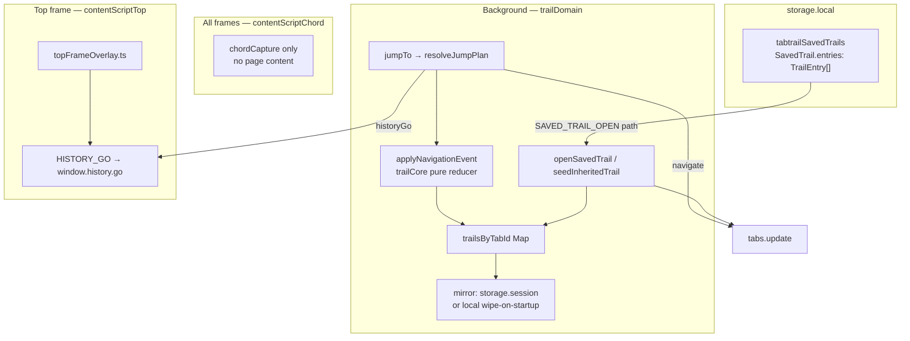
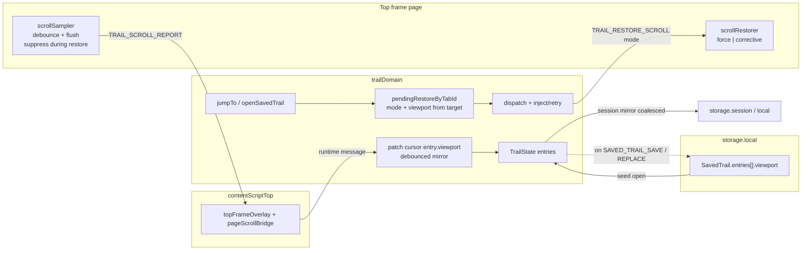
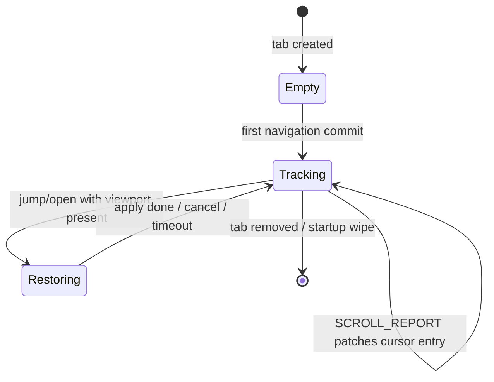
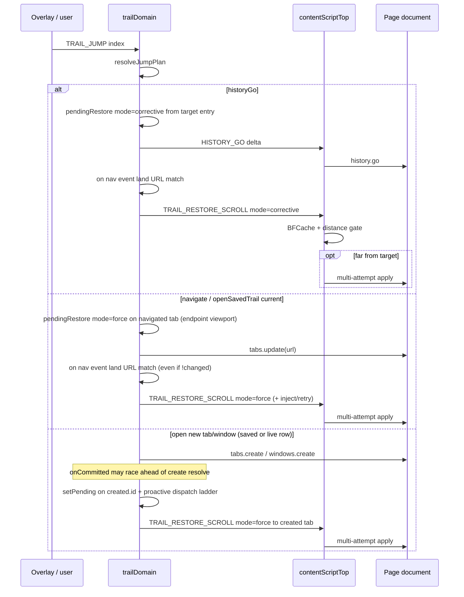

# Scroll / Last-Known Location Restoration for TabTrail

| Field | Value |
|-------|-------|
| **Author** | TabTrail maintainers |
| **Date** | 2026-07-12 |
| **Status** | Draft — ready for implementation (rev 5; open product questions resolved) |
| **Scope** | Viewport scroll capture & restore for live (session) trails and saved trails |
| **Related** | `src/lib/core/trail/trailCore.ts`, `src/lib/backgroundRuntime/domains/trailDomain.ts`, `src/lib/adapters/storage/savedTrailsStore.ts`, `PRIVACY.md`, `STABILITY.md` |

---

## Overview

TabTrail already tracks a **cursor + truncate navigation trail** per tab and a **durable named path library** (saved trails). Jumping a breadcrumb prefers `history.go(delta)` when the span is history-backed, which often preserves scroll via the browser’s own history/BFCache machinery. When the jump falls back to direct navigation (`tabs.update`), when a **saved trail is opened**, when a path is **seeded into a new tab**, or when SPA/layout timing defeats native restoration, the user lands at the top of the page and loses their place.

This design adds **reliable last-known viewport restoration** in two clearly separated scopes:

1. **Session scroll cache** — per-tab, lives and dies with the live trail (session mirror / in-memory for private tabs). Restores when the user returns to a trail entry within that tab’s session.
2. **Saved-trail scroll association** — durable viewport snapshots co-located with saved path entries in `storage.local`, restored when opening or jumping within a saved path (after seed inheritance).

Reliability is the bar: late-loading content, SPA soft-nav, BFCache, document vs nested scroll roots, multi-frame pages, and private windows are handled explicitly. The approach reuses TabTrail’s existing pure-core + domain + content-script split; it does **not** introduce a server, and it does not broaden tracking beyond numeric viewport offsets tied to URLs the user already stores.

**Restore priority note:** `createInheritedTrailState` marks only index `0` as `historyBacked`. Nearly every breadcrumb jump inside a seeded/saved path therefore resolves to **`navigate`**, not `historyGo`. Force restore on those jumps is mandatory product surface, not an edge case.

---

## Background & Motivation

### Current architecture (ground truth)



| Concern | Today | Gap |
|---------|-------|-----|
| Trail entry shape | `url`, `title`, `favIconUrl`, `timestamp`, `transition`, `redirected`, `historyBacked` in `src/types.d.ts` | **No viewport / scroll field** |
| Jump | `resolveJumpPlan` → `historyGo` or `navigate` (`trailCore.ts` `resolveJumpPlan`; `trailDomain.jumpTo`) | `historyGo` often keeps scroll; **`navigate` always cold-loads top** |
| Saved / inherited open | `openSavedTrail` + `createInheritedTrailState` (only root edge history-backed) then navigate | Seed copies entries **without** scroll; almost all in-path jumps are `navigate` |
| Content scripts | Chord (all frames) + Top (overlay + `HISTORY_GO`) at `document_start` | **No scroll sample/restore path** |
| “Restore” in code | Focus restore (`focusRestore.ts`), saved-trail undo (`SAVED_TRAIL_RESTORE`), library re-add | **Not viewport scroll** |
| Privacy | Incognito trails memory-only; durable saved mutations refused in private (`trailMessageHandler.ts`) | Scroll must **follow the same policy** |

### Pain points

1. **Direct navigation jumps drop place.** Redirected edges, inherited `historyBacked: false` prefixes (including nearly the entire saved-path seed), and catch fallbacks force `tabs.update` — user loses scroll every time.
2. **Saved trails always open cold.** Opening a research path re-lands at page tops; the value of the path is reduced for long articles/docs.
3. **SPA + layout shift.** Even when history restores a pixel offset, lazy content reflow can leave the user above/below the intended section; multi-attempt restore is needed for non-BFCache loads.
4. **No sampling surface.** There is nowhere today that reads `scrollY` / scroll roots on the page.

### Why now

The product already promises “jump back without losing context” via history-backed jumps (README). Completing that promise for the navigate/saved-trail cases is the remaining hole, and it can be implemented without changing the trail reducer’s navigation semantics if viewport is treated as **entry metadata**, not a navigation edge.

---

## Goals & Non-Goals

### Goals

1. **Session restore:** When the user returns to a live trail entry in the same tab (breadcrumb jump or browser back/forward that lands on a known trail entry), restore last-known viewport when the browser does not (or does not reliably) restore it.
2. **Saved-trail restore:** When opening a saved trail (current or new tab) or jumping among its seeded entries, restore each entry’s last-known viewport associated with that saved path (or with the live seeded copy).
3. **Reliability under real pages:** Debounced sampling, multi-attempt apply, BFCache awareness, top-frame-only capture aligned with `frameId === 0` trail tracking, graceful degradation when the root is ambiguous.
4. **Privacy alignment:** On-device only; session vs durable separation; no durable scroll writes from private windows; no page content, form fields, or screenshots.
5. **Incremental ship:** Pure types/normalizers first; capture; restore for navigate jumps; saved-trail durability; polish for SPA/layout.

### Non-Goals

| Non-goal | Rationale |
|----------|-----------|
| Full nested scroll-container tree capture (every `overflow: auto` node) | Combinatorial, fragile selectors, high cost; v1 captures **document/window + optional single primary nested root** (with element-level listeners — see Capture) |
| Cross-device / account sync | Product is local-only (`PRIVACY.md`) |
| Form field, caret, selection, or media playback restore | Out of scope; privacy-sensitive |
| Element-anchored restore (`scrollIntoView` of a CSS selector / text fragment) | Attractive later; not required for v1 “last known location” |
| Persisting scroll for private/incognito into `storage.local` | Forbidden by existing private-trail policy |
| Changing `resolveJumpPlan` history-vs-navigate rules | Scroll restore **complements** history.go; does not replace it |
| Subframe (iframe) trail tracking | Trail already ignores `frameId !== 0`; scroll stays top-document |
| Guaranteeing pixel-perfect restore on every SPA | Best-effort multi-attempt with timeout; document residual risk |
| Virtualized lists that recycle scroll DOM | Residual failure; document limitation even with nested-root heuristic |

---

## Proposed Design

### High-level architecture



**Spine invariant:** background remains the authority for trail state (including viewport metadata). Content scripts only **sample** and **apply**; they never own durable state. **Policy ownership is split:** domain chooses restore **mode** (`force` | `corrective`); content measures distance / BFCache and applies or no-ops for `corrective`.

### Two scopes (explicit separation)

| Scope | Lifetime | Storage | Keying | Writers | Readers |
|-------|----------|---------|--------|---------|---------|
| **Session scroll** | Tab lifetime; cleared on tab close / browser restart (same as live trail) | In `TrailEntry.viewport` inside `trailsByTabId` + existing trail mirror (`tabtrailTrail:<tabId>`) | Trail entry identity via **cursor + url match** at patch time; restore from pending target URL | Debounced `TRAIL_SCROLL_REPORT` from top content script | `jumpTo` landing, corrective history landings, open-seeded navigation |
| **Saved-trail scroll** | Until user deletes/updates the saved trail | `SavedTrail.entries[i].viewport` in `tabtrailSavedTrails` | Path entry index within that saved trail’s ordered path | Capture at **save** / **replace** from the live path (scroll-only replace **is** a real write — see Equality); no continuous durable write in v1 | `openSavedTrail` pending restore from **path endpoint at open time**; subsequent jumps use session entries |

**Why embed on `TrailEntry` rather than a parallel map?**

- Session mirror already serializes `TrailState`; after normalizer support, viewport rides through `scheduleMirrorTrail` (not “for free” today — see Normalization).
- Saved paths are `TrailEntry[]`; save/replace already clone entries (`savedTrailsStore.ts`).
- Seed inheritance (`createInheritedTrailState`) copies entries and naturally carries viewport into new tabs once present.
- **Path uniqueness** must ignore viewport (`savedTrailPathsEqual`); **full entry equality used by replace** must **include** viewport so scroll-only updates persist (see Equality).

### Data model

#### New type (shared, `src/types.d.ts`)

```ts
/** Last-known viewport for a trail entry. Coordinates are CSS pixels. */
interface TrailViewport {
  /** Horizontal offset of the restored scroll root. */
  x: number;
  /** Vertical offset of the restored scroll root. */
  y: number;
  /**
   * Scroll height of the root when sampled (for clamping after reflow).
   * Optional; missing ⇒ clamp only against live max at restore time.
   */
  scrollHeight?: number;
  /**
   * Which root was sampled.
   * - "document": document.scrollingElement / window
   * - "element": a single primary nested scroller (selector best-effort)
   */
  root?: "document" | "element";
  /** CSS selector for root === "element"; ignored for document. */
  rootSelector?: string;
  /** Epoch ms when sampled (debug / staleness). */
  capturedAt?: number;
}

/** How the content script should apply a restore. Chosen by the domain. */
type TrailScrollRestoreMode = "force" | "corrective";
```

#### `TrailEntry` extension

```ts
interface TrailEntry {
  url: string;
  title: string;
  favIconUrl: string;
  timestamp: number;
  transition: TrailTransition;
  redirected: boolean;
  historyBacked: boolean;
  /** Optional last-known viewport; absent ⇒ no restore attempt. */
  viewport?: TrailViewport;
}
```

#### Normalization rules (`normalizeTrailState` / `normalizeSavedTrailEntries`)

**Critical implementer note:** Today `normalizeTrailState` **reconstructs** each entry field-by-field (`trailCore.ts`) and **drops unknown keys**. Viewport does **not** ride the session mirror or rehydrate until PR1 extends that reconstruction. “Additive / heal-on-read” only works **after** that change.

Rules:

- Accept `viewport` only when `x`/`y` are finite numbers; clamp to `x >= 0`, `y >= 0`; drop NaN/Infinity.
- Cap magnitude (e.g. `y <= 1e7`) to avoid garbage storage.
- Drop unknown `root` values; drop `rootSelector` if not a non-empty string ≤ 256 chars.
- **Missing `viewport` is valid** — existing saved trails and session mirrors migrate with zero behavior change.
- **Round-trip:** `normalizeTrailState` of a state that includes valid viewport must preserve it; invalid viewport objects are stripped (entry kept without viewport).
- Do **not** require a storage schema version bump solely for additive optional fields; normalizers are the migration (consistent with heal-on-read; keep `STORAGE_SCHEMA_VERSION === 2`). If a future change renames or restructures, chain `STORAGE_SCHEMA_VERSION` ≥ 3 in `storageMigrations.ts`.

#### Equality helpers (`savedTrailCore.ts`)

| Helper | Viewport treatment | Why |
|--------|-------------------|-----|
| `savedTrailPathsEqual` | **Ignore** viewport (already ignores title/favicon/timestamp/`redirected`) | Path uniqueness must not flip when only scroll (or cosmetics) change |
| `savedTrailEntriesEqual` | **Include viewport** (deep-compare normalized x/y/root/rootSelector/scrollHeight; treat missing ≡ missing) | **Required for durable scroll.** `replaceSavedTrail` early-returns when `savedTrailEntriesEqual(current, replacement)` (`savedTrailsStore.ts`). If viewport is ignored, open → scroll → “Update path” with unchanged URLs **never persists scroll**. The overlay treats equal previous/result as “already matches” and skips undo/success. Scroll-only replace is a **deliberate durable write**. |
| Live session patch | Viewport patches are separate, cursor-url-matched | Same discipline as `applyCursorEntryPatch`; does not go through `savedTrailEntriesEqual` |

Document this next to the equality helpers. Path uniqueness ≠ full snapshot equality.

**Test lock (PR1 + store):** same URL/title/transition path + different viewport → `savedTrailPathsEqual` true, `savedTrailEntriesEqual` false → `replaceSavedTrail` mutates and returns updated trail.

### Session scroll cache

#### Authority and lifecycle



- **Memory:** `trailsByTabId` remains authoritative for the worker lifetime (existing design).
- **Mirror:** Viewport is part of `TrailState` **after** normalize support. In-memory patch is immediate; **mirror writes for viewport-only changes are coalesced** (see Mirror coalescing below).
- **Incognito:** Same as trails — keep in memory; **never** write mirror when `incognito && !mirrorIsSessionScoped` (`scheduleMirrorTrail` guard). Under Chrome MV3 `incognito: "split"`, the **private extension process** may use that process’s `storage.session` for private-tab trails — consistent with existing trail policy (not the regular profile’s store). Viewport is the same class of data (page location metadata, not content).
- **Tab close:** `handleTabRemoved` deletes map + mirror key; scroll dies with the trail.
- **Startup wipe:** local-fallback keys under `TRAIL_MIRROR_KEY_PREFIX` already cleared in `handleStartup`.

#### Identity for patch / restore

Do **not** introduce stable entry UUIDs in v1 (would touch every reducer path and tests for limited gain).

1. **Patch:** only update `entries[cursor].viewport` when report `url` **strict-equals** cursor entry `url` (same as `applyCursorEntryPatch` / `tab.url !== entry.url`). Content should send `location.href` as the browser exposes it; trail URLs come from `webNavigation`. Encoding mismatches drop the sample — **expected after nav races**, not silently “fixed” with fuzzy URL parsing in v1. Domain tests count mismatch drops (PR2).
2. **Restore target:** taken from **pending restore** set at jump/open time (URL + viewport + mode), **not** re-derived solely from post-reduce cursor metadata (critical for open/seed races — see Pending restore).
3. **Truncate:** when `TRAIL_MAX_ENTRIES` drops prefix entries, their viewport is dropped with them — acceptable.
4. **In-place refresh** (reload / same-URL / replaceState churn): current `refreshEntry` is `{ ...entry, url, timestamp, redirected }` and **already preserves** `viewport` via object spread. **Do not rewrite `refreshEntry` for viewport.** Lock this with a unit test. The real footgun is `normalizeTrailState` dropping fields — that is the required PR1 change. `makeEntry` continues to omit viewport (new navigations start clean).
5. **SPA soft-nav to a new URL:** reducer appends or moves cursor; new entry starts without viewport until samples arrive; previous entry retains last sample (after flush).

#### Capture pipeline (top content script)

New module `src/lib/appInit/pageScrollBridge.ts`, initialized **from `initTopFrameOverlay()`** so both `contentScriptTop.ts` and the combined fallback `contentScript.ts` (which already calls `initTopFrameOverlay()`) inherit the bridge automatically. Do **not** init only from the top entry file.

| Event / source | Action |
|----------------|--------|
| `scroll` on **window** (capture, passive) | Debounce **150–200 ms**, then sample — **unless restore gate active** |
| `scroll` on **bound nested root element** (passive) | Same debounce path when `root === "element"` |
| `scrollend` where available (window + bound element) | Flush immediately (cancel debounce) — unless restore gate |
| `pagehide` / `visibilitychange` → hidden | **Synchronous flush** of last sample (critical for navigate away); still suppressed if restore gate only if we choose not to learn mid-restore (v1: **suppress** — do not overwrite target with mid-restore Y) |
| `popstate` | Flush previous position **then** cancel any in-flight restore if `location.href` no longer matches restore URL (see SPA cancel) |
| Periodic safety poll | Every **2 s** while document visible: if position changed, sample (backup for odd pages **and** for nested roots before bind completes) |

**Restore sampling gate:** While a restore generation is **live** (between receiving `TRAIL_RESTORE_SCROLL` and success / cancel / timeout), **do not send `TRAIL_SCROLL_REPORT`**. Programmatic `scrollTo` fires `scroll` events; reporting them would overwrite the stored target with intermediate Y and freeze a wrong viewport if the user navigates away mid-restore. Optional: after **successful** stable restore, a single report matching the target is unnecessary (memory already has target). Clear the gate on success, user cancel, generation supersede, URL mismatch cancel, or timeout.

**Sample algorithm (`readViewport()`):**

1. Prefer `document.scrollingElement` scrollTop/Left; also read `window.scrollX/Y` and take the max pair if they disagree (quirks mode / odd pages).
2. If document max scroll (`scrollHeight - clientHeight`) is **&lt; 32px** but a single large descendant has substantial overflow, treat that element as **primary nested root**:
   - Heuristic: among elements with `scrollHeight - clientHeight >= 200` and computed overflow-y auto/scroll, pick the largest area that is roughly viewport-sized (or the largest scroll range).
   - Store `root: "element"` + a short selector (`id` preferred; else `tag:nth-of-type` path capped at depth 4). If no stable selector, fall back to document offsets only.
3. **Nested listener bind (required for nested reliability):** After choosing `root: "element"`, attach a passive `scroll` (and `scrollend` if available) listener on that element. On DOM mutations (debounced `MutationObserver` or re-check on the 2 s poll), re-resolve the element and re-bind if the node was replaced. **Scroll events do not bubble** — window listeners alone never see nested-only scrolling. Residual failure remains for virtualized lists that recycle the scroller node or use non-element scroll mechanisms.
4. Record `scrollHeight` of the chosen root for later clamping.
5. Send `TRAIL_SCROLL_REPORT` only when the rounded `(x,y)` changed since last successful report **or** on unload flush — and only when restore gate is inactive.

**Budget discipline:** keep bridge logic small; `contentScriptTop.js` budget is **45 KB** (`test/bundle-budget.test.mjs`). Prefer pure helpers in `viewportCore.ts` unit-tested under Node. Chord stays 20 KB — no scroll logic there.

#### Report message and in-memory + mirror patch

```ts
// BackgroundRuntimeMessage addition
| {
    type: "TRAIL_SCROLL_REPORT";
    url: string;
    viewport: TrailViewport;
  }
```

Handler (`trailMessageHandler` → domain):

```ts
// Pseudocode in trailDomain
function applyScrollReport(tabId: number, url: string, viewport: TrailViewport): void {
  void tabQueue.run(tabId, async () => {
    const state = trailsByTabId.get(tabId);
    if (!state || state.cursor < 0) return;
    const entry = state.entries[state.cursor];
    // Strict string equality — same footgun as title patch; mismatch drops are expected after races.
    if (!entry || entry.url !== url) {
      // test/observability: count mismatch drop
      return;
    }
    if (viewportEquals(entry.viewport, viewport)) return;
    const entries = state.entries.slice();
    entries[state.cursor] = { ...entry, viewport: normalizeViewport(viewport) };
    trailsByTabId.set(tabId, { entries, cursor: state.cursor });
    scheduleMirrorTrailCoalesced(tabId, { reason: "viewport" });
    // Do NOT notify overlay — viewport is not UI chrome state
  });
}
```

##### Mirror coalescing (viewport-only)

`scheduleMirrorTrail` writes the **full** `TrailState` blob. Continuous scroll must **not** rewrite storage every 150–200 ms for long trails (up to 100 entries) — that keeps the MV3 worker warm and thrash-writes session/local storage far more than rare title patches.

| Path | Mirror behavior |
|------|-----------------|
| Viewport-only in-memory patch | Coalesce: arm a **500–1000 ms** timer per tab; only one mirror write after the quiet period |
| Unload / pagehide flush report | **Flush mirror immediately** (cancel coalesce timer, write now) |
| Navigation reduce, jump, seed, title/favicon patch, tab remove | Existing immediate `scheduleMirrorTrail` (or remove) — unchanged urgency |
| Worker suspend risk | Accept that a kill during the coalesce window may lose the last ≤1 s of scroll; continuous samples still improve over pagehide-only |

Throttle: domain may also ignore reports more frequent than ~100 ms wall clock per tab for CPU, independent of mirror coalesce.

### Restore pipeline

#### Modes (domain chooses; content enforces)

| Mode | Set by domain when | Content behavior |
|------|--------------------|------------------|
| `"force"` | `navigate` jump plan; `HISTORY_GO` send failure → navigate fallback; **any inherited endpoint open** (`openSavedTrail` current/new, `openEntryInNewTab`, `openEntryInNewWindow`); inject-retry for those paths | Always multi-attempt apply if viewport present (subject to fragment rule below and user cancel) |
| `"corrective"` | Successful `historyGo` jump; browser chrome `forward_back` land when stored viewport exists on the landed entry (synthesized after reduce — see PR5a branch) | Prefer native/BFCache. After settle (rAF + ~50–100 ms): if `pageshow.persisted` and within distance threshold, **no-op**. If `|Δy| > max(80px, 5% of scrollHeight)` (and same for x if significant), run multi-attempt apply. Distance is measured **only in the page** — background never estimates it. |

Domain **always** dispatches `TRAIL_RESTORE_SCROLL` when pending restore exists and landing URL matches — it does **not** try to decide “only if needed” for corrective; content implements the gate.

#### When to restore



| Landing path | Mode | Notes |
|--------------|------|-------|
| `historyGo` jump | `corrective` | Content owns “only if needed” |
| `navigate` jump / `tabs.update` | `force` | Always attempt if viewport present |
| `openSavedTrail(..., "current")` | `force` | Pending on **that** tab **before** `tabs.update`, from path endpoint viewport |
| `openSavedTrail(..., "new")` / `openEntryInNewTab` | `force` | Pending on **`created.id`** (not source tab) inside `createTabFromInheritedTrail`; proactive dispatch (see below) |
| `openEntryInNewWindow` | `force` | Pending on seeded tab id from `windows.create` when profile matches; same proactive dispatch |
| In-trail jump on seeded path | usually `force` | Nearly all edges `historyBacked: false` → `navigate` (K13) |
| Browser chrome back/forward (`forward_back`) | `corrective` | **Synthesize** pending after reduce when no jump pending (PR5a; see branch below) |
| Reload of same entry | optional `corrective` | Low priority v1 |
| No viewport | no pending | No-op |

##### Fragment / hash rule (v1 — implementable)

**Chosen rule for PR4 force restores:**

1. If restore URL has no `location.hash` (or hash is empty/`#`), apply absolute Y as usual.
2. If URL has a non-empty hash, let `id = decodeURIComponent(hash.slice(1))` (ignore empty).
3. **Nested-root guard:** If the effective restore root is nested (`viewport.root === "element"` or resolved root is not document/window), **do not** apply the near-anchor skip — document-space `elementTop` and nested `scrollTop` are different coordinate spaces. Always apply stored nested offsets.
4. After first paint attempt (document/window root only), if `document.getElementById(id)` (or `document.getElementsByName(id)[0]`) resolves to an element:
   - Let `elementTop = element.getBoundingClientRect().top + window.scrollY`.
   - Let `currentY = readViewport().y` (document root).
   - If `|elementTop - currentY| < 80` **and** we are in the first ~300 ms after land, **skip force restore** (browser/CSS anchor already won).
   - Otherwise apply stored viewport (user’s last-known place may differ from the fragment target — e.g. they scrolled after landing on `#section`).
5. If the hash target element is missing, apply stored viewport normally.

This is deterministic for implementers; no open-ended “near fragment” judgment beyond the 80 px threshold.

#### Pending restore handoff

```ts
const pendingRestoreByTabId = new Map<number, {
  url: string;
  viewport: TrailViewport;
  mode: TrailScrollRestoreMode;
  generation: number; // monotonic per tab; content ignores stale gens
  createdAt: number;
  timeoutId?: ReturnType<typeof setTimeout>;
}>();

const PENDING_RESTORE_TTL_MS = 3000;
const DISPATCH_LADDER_MS = [50, 200, 500] as const;
```

**Helper — arm pending + active TTL + optional proactive dispatch ladder:**

```ts
function setPendingRestore(
  tabId: number,
  spec: { url: string; viewport: TrailViewport; mode: TrailScrollRestoreMode },
  options?: { proactiveDispatch?: boolean },
): void {
  clearPendingRestore(tabId); // clears prior timeout + map entry
  const generation = nextGeneration(tabId);
  const createdAt = Date.now();
  const timeoutId = setTimeout(() => {
    const cur = pendingRestoreByTabId.get(tabId);
    if (cur && cur.generation === generation) pendingRestoreByTabId.delete(tabId);
  }, PENDING_RESTORE_TTL_MS);
  pendingRestoreByTabId.set(tabId, {
    url: spec.url,
    viewport: normalizeViewport(spec.viewport),
    mode: spec.mode,
    generation,
    createdAt,
    timeoutId,
  });
  if (options?.proactiveDispatch) {
    // Covers commit-before-create-resolves: do not wait solely for the next nav event.
    void dispatchPendingRestore(tabId, spec.url);
    for (const delay of DISPATCH_LADDER_MS) {
      void sleep(delay).then(() => dispatchPendingRestore(tabId, spec.url));
    }
  }
}

function clearPendingRestore(tabId: number): void {
  const prev = pendingRestoreByTabId.get(tabId);
  if (prev?.timeoutId != null) clearTimeout(prev.timeoutId);
  pendingRestoreByTabId.delete(tabId);
}
```

**Set sites (explicit — tab id must be the tab that will load the endpoint):**

```ts
// 1) jumpTo — pending on the tab being jumped (always known)
setPendingRestore(targetTabId, {
  url: state.entries[index].url,
  viewport: state.entries[index].viewport!,
  mode: plan.kind === "historyGo" ? "corrective" : "force",
});
// if HISTORY_GO send fails → flip mode to "force" on the same pending entry

// 2) openSavedTrail(..., "current") — pending on the navigated tab BEFORE tabs.update
const inherited = createInheritedTrailState(path);
const endpoint = inherited.entries[inherited.cursor];
if (endpoint?.viewport) {
  setPendingRestore(targetTabId, {
    url: endpoint.url,
    viewport: endpoint.viewport,
    mode: "force",
  });
}
await browser.tabs.update(targetTabId, { url: endpoint.url });
scheduleSeedInheritedTrail(targetTabId, inherited);
// Nav-event dispatch still runs; proactive optional for current-tab (nav land is reliable enough)
// Prefer also: void dispatchPendingRestore(targetTabId, endpoint.url) once after update for inject races.

// 3) ANY new-tab inherited open — centralize in createTabFromInheritedTrail
//    Callers: openSavedTrail(..., "new"), openEntryInNewTab
async function createTabFromInheritedTrail(state, sourceTab, active) {
  const endpoint = state.entries[state.cursor];
  const created = await browser.tabs.create({ url: endpoint.url, /* … */ });
  if (created.id == null) return { ok: false, reason: "Could not open tab" };
  // CRITICAL: arm on created.id — NEVER on resolveTargetTabId / sender (source) tab
  if (endpoint.viewport) {
    setPendingRestore(created.id, {
      url: endpoint.url,
      viewport: endpoint.viewport,
      mode: "force",
    }, { proactiveDispatch: true });
  }
  scheduleSeedInheritedTrail(created.id, state);
  // Optional: after seedInheritedTrail completes, if pending still present and live URL matches,
  // void dispatchPendingRestore(created.id, endpoint.url) once more (land-before-pending safety).
  return { ok: true };
}

// 4) openEntryInNewWindow — same surface on the seeded destination tab
const created = await browser.windows.create({ url: endpoint.url, incognito: sourceIncognito });
const seededTabId = created.tabs?.find((t) => t.id != null)?.id;
if (seededTabId != null && created.incognito === sourceIncognito && endpoint.viewport) {
  setPendingRestore(seededTabId, {
    url: endpoint.url,
    viewport: endpoint.viewport,
    mode: "force",
  }, { proactiveDispatch: true });
  scheduleSeedInheritedTrail(seededTabId, inherited);
}
```

**Why open must not derive pending from post-reduce cursor:** Seed is eventual-consistent (`scheduleSeedInheritedTrail` fire-and-forget; `trail-domain-open-throughput.test.mjs`). Navigation reduce can create a cold `makeEntry` (no viewport) **before** seed lands. Pending must be populated from the **normalized path/endpoint viewport** at open/jump call time. Dispatch when **landed/probed URL matches `pending.url`**, regardless of whether the seeded map already has viewport on the cursor entry.

**Why new-tab must not use `resolveTargetTabId`:** That id is the **source** (sender/active) tab. Pending must be armed on **`created.id` / seeded window tab id** only after create returns — and then **proactively dispatched**, because `webNavigation.onCommitted` often fires **before** `tabs.create` resolves:

```text
1. tabs.create({ url }) starts load
2. onCommitted → dispatchPendingRestore → no pending yet → no-op   ← without proactive re-dispatch, restore is lost
3. create resolves → setPendingRestore(created.id) + proactive dispatch ladder (+ inject/retry)
```

**Dispatch** (nav land, proactive ladder, or post-seed re-check):

```ts
type TopFrameSendResult =
  | { transported: false }
  | { transported: true; accepted: boolean; reason?: string };

// accepted === true only when CS response is { ok: true } (URL gate passed, generation armed).
// transported === true alone means tabs.sendMessage resolved — NOT enough to clear pending
// (same distinction as pushTrailToTab: any resolved send is "delivered", response may still fail).

async function sendRestoreToTopFrame(
  tabId: number,
  message: ContentRuntimeMessage,
): Promise<TopFrameSendResult> {
  try {
    const response = await browser.tabs.sendMessage(tabId, message, { frameId: 0 }) as unknown;
    const ok =
      typeof response === "object" &&
      response !== null &&
      (response as { ok?: unknown }).ok === true;
    return {
      transported: true,
      accepted: ok,
      reason: !ok && typeof (response as { reason?: unknown })?.reason === "string"
        ? (response as { reason: string }).reason
        : undefined,
    };
  } catch (_) {
    return { transported: false };
  }
}

async function dispatchPendingRestore(tabId: number, landedUrl: string): Promise<void> {
  const pending = pendingRestoreByTabId.get(tabId);
  if (!pending || pending.url !== landedUrl) return;
  if (Date.now() - pending.createdAt > PENDING_RESTORE_TTL_MS) {
    clearPendingRestore(tabId);
    return;
  }
  const message = {
    type: "TRAIL_RESTORE_SCROLL" as const,
    url: pending.url,
    viewport: pending.viewport,
    mode: pending.mode,
    generation: pending.generation,
  };
  let result = await sendRestoreToTopFrame(tabId, message);
  if (!result.transported) {
    const tab = await browser.tabs.get(tabId).catch(() => null);
    if (tab && didInjectContentScript(await injectContentScriptIntoTab(tab))) {
      await sleep(50);
      result = await sendRestoreToTopFrame(tabId, message);
    }
  }
  // CRITICAL: clear only on content acceptance, never on bare transport success.
  // Early proactive ticks often hit about:blank / pre-commit URL → CS returns
  // { ok: false, reason: "url-mismatch" | "not-ready" } while sendMessage still resolves.
  // Clearing on transported would drop pending and undo the new-tab race fix (K16).
  if (result.transported && result.accepted) {
    clearPendingRestore(tabId);
    return;
  }
  // Keep pending for ladder + onCommitted retries until TTL / tab remove / supersede / startup.
}
```

**Content response contract (acceptance vs apply completion):**

| CS response | Meaning | Domain action |
|-------------|---------|---------------|
| `{ ok: true }` | URL matched (or held until match — optional), generation armed, multi-attempt **started** | **Clear pending** (apply continues asynchronously in CS) |
| `{ ok: false, reason: "url-mismatch" }` | `location.href !== message.url` at receive time | **Keep pending** |
| `{ ok: false, reason: "not-ready" }` | Document not usable yet | **Keep pending** |
| `undefined` / throw | No listener / wrong frame / navigated mid-send | **Keep pending** (inject/retry if !transported) |

Domain does **not** wait for multi-attempt settle/success — only for acceptance. Optional CS improvement: for `mode: "force"`, hold the message up to ~2s until `location.href` matches before returning ok/false (reduces ladder chatter); acceptance-based clear remains the minimum correctness bar either way.

**`handleNavigationDetails` placement (independent of reducer `changed`):**

```ts
void tabQueue.run(tabId, async () => {
  // … ensureLoaded, isIncognitoTab, take pendingJump …
  const event = { /* … */, pendingJumpIndex, pendingJumpKind };
  const landedUrl = details.url;
  const { state, changed } = applyNavigationEvent(getTrailState(tabId), event);
  if (changed) {
    trailsByTabId.set(tabId, state);
    scheduleMirrorTrail(tabId);
    notifyOverlayIfOpen(tabId);
  }
  // Restore dispatch is NOT gated on changed — duplicate commits / same-URL races
  // must still deliver pending restore when URL matches.
  void dispatchPendingRestore(tabId, landedUrl);

  // PR5a only — browser chrome back/forward without extension jump:
  // if (!pendingJump && hasQualifier(event, "forward_back")) {
  //   const entry = trailsByTabId.get(tabId)?.entries[cursor];
  //   if (entry?.viewport && entry.url === landedUrl && !pendingRestoreByTabId.has(tabId)) {
  //     setPendingRestore(tabId, { url: entry.url, viewport: entry.viewport, mode: "corrective" });
  //     void dispatchPendingRestore(tabId, landedUrl);
  //   }
  // }
}).then(() => { void patchCursorEntryFromLiveTab(tabId); });
```

Also `clearPendingRestore` on `handleTabRemoved` / `handleStartup` / superseded `setPendingRestore` for the same tab.

#### Apply algorithm (`applyViewport(message)`)

Inputs: `{ url, viewport, mode, generation }`.

1. **URL gate (drives response.ok):** if `location.href !== url` (strict), return `{ ok: false, reason: "url-mismatch" }` **without** arming generation and **without** starting apply. Domain **keeps** pending so ladder/nav can retry. (Optional force hold: wait up to ~2s for href match before deciding.) Also reject with not-ok if generation is stale relative to a newer accepted restore.
2. On pass: return `{ ok: true }` to the message handler **as soon as** generation is accepted and restore sampling gate is armed (multi-attempt may still be in flight). Domain clears pending on this ack only.
3. If `mode === "corrective"`:
   - Wait rAF + ~50–100 ms.
   - If `pageshow` was persisted (track via `pageshow` listener flag) and distance to target ≤ threshold, clear gate and return.
   - If distance ≤ threshold, clear gate and return.
   - Else fall through to multi-attempt apply.
4. Resolve root early: document vs `querySelector(rootSelector)` if still connected and scrollable; else document. Needed before fragment rule (nested vs document coordinate spaces).
5. Apply **fragment rule** for `mode === "force"` only when effective root is document/window (see Fragment rule nested-root guard).
6. Clamp: apply **absolute** stored `x`/`y` (v1 — no ratio scaling). Prefer retry over permanent clamp-to-zero when live max is temporarily much smaller than stored `scrollHeight` (e.g. liveMax &lt; 0.5 * stored and y &gt; liveMax). Always restore **both axes**.
7. Apply via `root.scrollTop/Left` and/or `window.scrollTo({ left: x, top: y, behavior: "instant" })` (fallback `behavior: "auto"`).
8. **Multi-attempt schedule** (cancel on success stability, user interrupt, URL change, generation supersede, or timeout):
   - `requestAnimationFrame` × 2
   - `document.readyState` transitions if still loading
   - `load` event once
   - `ResizeObserver` on `document.documentElement` (and root element) debounced 50 ms
   - Cap: **~2.0 s** or **12 attempts**, whichever first
9. **Stability success:** after apply, next frame `|read - target| <= 4px` **or** target beyond max and we are within 4px of max → clear gate.
10. **User interrupt:** trusted `wheel`, `touchmove`, or `keydown` (space/page/arrow keys) cancels further attempts for this generation and clears gate.
11. **SPA / URL cancel:** if `location.href` diverges from message `url` at any attempt (check each tick), cancel and clear gate. Also cancel on `popstate` / soft-nav URL change (see below).

#### SPA soft navigation

- History state updates are already trail events (`onHistoryStateUpdated`). Content script remains alive across `pushState` (same document) — **no full unload**.
- **Cancel in-flight restore** when:
  - `popstate` fires and `location.href !== restoreUrl`, or
  - a lightweight URL check on each restore attempt / on a short interval during restore sees divergence, or
  - a new `TRAIL_RESTORE_SCROLL` arrives (new generation supersedes).
- On soft-nav away: flush sample **before** cancel only if restore gate is inactive; if gate active, do not report mid-restore Y.
- On soft-nav land: domain sends restore if pending/jump with mode; ordinary SPA nav to a **new** trail entry without viewport → no restore message → any prior restore must already have been cancelled by URL change.
- For SPA land on an **existing** back_forward match with stored viewport → domain may dispatch `corrective`.

### Saved-trail scroll association

#### Capture into durable storage

| Action | Viewport behavior |
|--------|-------------------|
| `SAVED_TRAIL_SAVE` (`saveCapturedTrail`) | Path from live trail may already carry session viewports → **persisted as-is** after `normalizeSavedTrailEntries`. |
| `SAVED_TRAIL_REPLACE` | Replacement path includes current viewports. Because **`savedTrailEntriesEqual` includes viewport**, scroll-only updates **mutate** storage and surface success/undo in the library UI. |
| Continuous scroll while “bound” to a saved trail id | **v1 non-goal (final).** No durable learn-while-browsing; no “Remember scroll” control. Users refresh durable scroll only via **save** or **Update path** (replace). |
| Private tab | Existing guard refuses durable mutations; no viewport reaches `tabtrailSavedTrails`. Session reports still patch in-memory trail only. |

#### Open / jump within saved path

1. Normalize open `path`. **`"current"`:** set force pending on the navigated tab from endpoint viewport **before** `tabs.update`. **`"new"`:** do **not** arm on the source tab; `createTabFromInheritedTrail` arms on `created.id` with **proactive dispatch** (see Pending restore).
2. `scheduleSeedInheritedTrail(createInheritedTrailState(path))` remains eventual — carries viewport into map when seed wins, but restore does not depend on seed timing.
3. Subsequent breadcrumb jumps use session restore; for seeded trails this is almost always **`force`** via `navigate` (K13).
4. Each new tab has its own session copy; scrolling updates session only until the user explicitly saves/replaces.

#### Live “Open in new tab / window” (same restore surface)

These are **not** library-only. They share inherited seed + cold endpoint load:

| API | Shared helper | Pending tab id |
|-----|---------------|----------------|
| `openSavedTrail(path, "new")` | `createTabFromInheritedTrail` | `created.id` |
| `openEntryInNewTab(index)` | `createTabFromInheritedTrail` after `slicePathToIndex` + `createInheritedTrailState` | `created.id` |
| `openEntryInNewWindow(index)` | `windows.create` + `scheduleSeedInheritedTrail` | seeded tab from `created.tabs` (when profile matches) |

All three set **`mode: "force"`** from the **endpoint entry’s viewport** when present. Implementing restore only in `openSavedTrail` would break the overview promise for live row actions.

#### Migration of existing saved trails

- No rewrite required: missing `viewport` is absent after normalize.
- First save/replace after upgrade starts filling viewports.
- No `STORAGE_SCHEMA_VERSION` bump for additive optional field.

### Content-script & cross-browser constraints

| Constraint | Design response |
|------------|-----------------|
| Firefox MV2 + Chrome MV3 | Use polyfill messaging; no `chrome.`-only scroll APIs |
| `run_at: document_start` | Sampler installs listeners early; restore multi-attempt handles late body |
| Split scripts | Bridge only via `initTopFrameOverlay` → automatic combined-entry coverage |
| Chord budget 20 KB | **Do not** add scroll logic to `contentScriptChord` |
| Privileged URLs | No CS → no sample/restore; jump already falls back without CS |
| Missing CS after land | **Inject + retry** restore delivery (Issue 6 / domain dispatch) |
| BFCache | `pagehide` flush; `pageshow.persisted` for corrective; scroll bridge independent of overlay destroy-on-hide |
| MV3 worker sleep | Debounced samples + coalesce mirror; unload flush with retry best-effort |
| `scrollend` / `behavior: "instant"` | Feature-detect; fallbacks to debounce-only and `behavior: "auto"` |

### Interaction with `history.go` (product truth)

Today README states history.go “preserving scroll position and the back/forward cache.” This design **keeps that as the primary path** via **`corrective` mode**. Custom restore is the compatibility layer for navigate fallbacks, saved/open seeds (almost always navigate), imperfect SPA history restore, and layout shift after native restore.

Never call `history.scrollRestoration = "manual"` globally in v1.

---

## API / Interface Changes

### Types (`src/types.d.ts`)

- Add `TrailViewport`, `TrailScrollRestoreMode`.
- Add optional `viewport?: TrailViewport` on `TrailEntry`.

### Runtime messages (`src/lib/common/contracts/runtimeMessages.ts`)

```ts
// → background
| { type: "TRAIL_SCROLL_REPORT"; url: string; viewport: TrailViewport }

// → content script (top frame)
| {
    type: "TRAIL_RESTORE_SCROLL";
    url: string;
    viewport: TrailViewport;
    mode: TrailScrollRestoreMode; // "force" | "corrective"
    generation: number;
  }
```

CS returns `{ ok: true }` only when the restore was **accepted** (URL gate passed, generation armed). Domain clears pending **only** on that acceptance — **not** when `tabs.sendMessage` merely resolves (`transported` without `accepted`). `{ ok: false, reason: "url-mismatch" | "not-ready" }` and missing/throw responses leave pending for ladder + `onCommitted` retries until TTL. Domain does not wait for multi-attempt settle; it does not block navigation on restore completion.

### Pure core (`trailCore.ts` / `savedTrailCore.ts`)

- `normalizeTrailState`: **must** parse/attach `viewport` (round-trip + strip invalid) — primary PR1 change.
- `makeEntry`: no viewport.
- `refreshEntry`: **already preserves** via spread — add test only; no behavior change required.
- `savedTrailPathsEqual`: ignore viewport (unchanged intent).
- `savedTrailEntriesEqual`: **include** normalized viewport (fix Issue 1).
- Pure helpers in `src/lib/core/trail/viewportCore.ts`: `normalizeViewport`, `viewportEquals`, `viewportDistance`, clamp helpers.

### Domain (`trailDomain.ts`)

- `applyScrollReport` + coalesced mirror for viewport-only patches.
- `setPendingRestore` / `clearPendingRestore` with **active TTL timer** (not timeout-only-on-dispatch).
- Pending armed in:
  - `jumpTo` (tab being jumped),
  - `openSavedTrail` **current** (before `tabs.update` on that tab),
  - **`createTabFromInheritedTrail`** (on `created.id`, proactive dispatch) — covers `openSavedTrail` **new** and `openEntryInNewTab`,
  - `openEntryInNewWindow` seed branch (seeded tab id, proactive dispatch).
- Never arm new-tab pending on `resolveTargetTabId` / sender (source) tab.
- `dispatchPendingRestore` from: nav land (**even when reducer `changed === false`**), proactive ladder after create, optional post-seed re-check; inject/retry when !transported.
- **Clear pending only when CS accepts** (`response.ok === true`); never clear on bare transport success. Also clear on TTL / tab remove / supersede / startup.
- Clear maps in tab removed / startup.

### Message handler (`trailMessageHandler.ts`)

- Route `TRAIL_SCROLL_REPORT` from `sender.tab.id`; ignore if no tab.
- No private refusal for session reports (session-only). Private tests: scroll reports never invoke saved-trail storage APIs.

### Client API (`tabtrailApi.ts`)

```ts
export async function reportTrailScroll(
  url: string,
  viewport: TrailViewport,
): Promise<void> {
  await sendRuntimeMessage({ type: "TRAIL_SCROLL_REPORT", url, viewport });
  // unload flush may use sendRuntimeMessageWithRetry
}
```

### Top frame (`topFrameOverlay.ts`)

- `initTopFrameOverlay` calls `installPageScrollBridge(...)` (init + cleanup in `__tabtrailTopCleanup`).
- Handle `TRAIL_RESTORE_SCROLL` next to `HISTORY_GO` (mode-aware).

### Privacy docs

- `PRIVACY.md`: state that session trails and saved trails may include **viewport pixel offsets (scroll position)** and optional scroll-root selector metadata; **never page content**, form data, keystrokes, or screenshots.

### Settings

- **v1:** no user toggle (always on). Optional later setting if site-fight reports appear.

---

## Data Model Changes

### Session mirror blob (illustrative)

```json
{
  "entries": [
    {
      "url": "https://example.test/article",
      "title": "Article",
      "favIconUrl": "…",
      "timestamp": 1710000000000,
      "transition": "link",
      "redirected": false,
      "historyBacked": true,
      "viewport": {
        "x": 0,
        "y": 1842,
        "scrollHeight": 9200,
        "root": "document",
        "capturedAt": 1710000123000
      }
    }
  ],
  "cursor": 0
}
```

### Size estimates

| Item | Estimate |
|------|----------|
| Per viewport object | ~40–80 bytes JSON |
| Live trail max 100 entries | **&lt; 8 KB** additional per tab worst case |
| Saved trails max 50 × short paths | typically small; worst case bounded by existing entry caps |
| Mirror write rate under scroll | **Coalesced ≤ ~1–2 writes/s** per actively scrolling tab (not per debounce tick) |

### Migration strategy

1. Ship normalizers that accept/omit/round-trip `viewport` (PR1 tests mandatory).
2. No forced rewrite of `tabtrailSavedTrails`.
3. Session mirrors self-heal on read **only after** normalize knows viewport.
4. Schema version stays at 2 unless a breaking reshape lands.

---

## Alternatives Considered

### A1. Parallel `scrollByTabId: Map<tabId, Map<entryKey, Viewport>>` instead of entry field

| Pros | Cons |
|------|------|
| Leaves `TrailEntry` pure “navigation edge” | Second mirror key / rehydrate path; easy to desync on truncate/seed; saved trails need a second structure anyway |

**Decision:** Reject for v1. Embedding on `TrailEntry` matches title/favicon metadata and seed/save plumbing.

### A2. Always set `history.scrollRestoration = "manual"` and fully own scroll

| Pros | Cons |
|------|------|
| Deterministic control | Breaks host page expectations; fights BFCache; high SPA breakage risk |

**Decision:** Reject. Prefer native restoration; `corrective` only when needed (content-measured).

### A3. Element-anchored restore (text fragment / selector of nearest heading)

| Pros | Cons |
|------|------|
| Survives layout shifts better than raw Y | DOM content inspection; privacy optics; brittle; larger CS |

**Decision:** Non-goal for v1.

### A4. Durable auto-learn: bind tab to `savedTrailId` and rewrite storage.local on scroll debounce

| Pros | Cons |
|------|------|
| Saved paths improve without explicit update | Write amplification; private edge cases; binding lifecycle; fights “save is explicit” UX |

**Decision:** Defer. v1 durable updates only via save/replace (with viewport included in entries equality).

### A5. Capture only on `pagehide` (no continuous debounce)

| Pros | Cons |
|------|------|
| Minimal messages | Weak SPA and crash resilience |

**Decision:** Reject as sole strategy; use debounced continuous + unload flush + nested element listeners.

### A6. Session-only scroll map in v1 (no durable saved-trail viewport)

| Pros | Cons |
|------|------|
| Faster ship of navigate-jump fix inside a live tab; smaller equality/store surface | Saved open — a co-equal product pain — remains cold; second schema later to bolt on durability; seed inheritance would not carry scroll without entry fields anyway |

**Decision:** Reject as the primary plan. Dual-scope from the start reuses one entry field for both pains. If staffing forces a cut line, ship PR1–PR4 session+force restore first and delay marketing saved-scroll until replace equality + open pending are tested — still use the same `TrailEntry.viewport` field so saved durability is not a redesign.

---

## Key Decisions

| # | Decision | Rationale |
|---|----------|-----------|
| K1 | **Viewport is optional metadata on `TrailEntry`**, not a parallel store | Reuses mirror, seed, save/replace; one normalize path; matches title/favicon precedent |
| K2 | **Separate session vs saved scopes by storage lifetime**, not by different schemas | Session rides trail mirror; saved rides `tabtrailSavedTrails`; same object shape |
| K3 | **Prefer browser/BFCache for history-backed lands; force restore for navigate / saved open** | Avoid fighting native behavior; fix paths that always lose scroll |
| K4 | **Top-frame-only sampling** aligned with `frameId === 0` | Subframes out of trail scope; chord bundle untouched |
| K5 | **Debounced sample + unload flush + multi-attempt apply (≤2 s); absolute X/Y (not ratio) in v1** | SPA layout shift and late content; ratio-based height-shift is follow-up only |
| K6 | **Document root first; single optional nested primary scroller with element-level listeners** | Window listeners miss nested scroll (events do not bubble); bind + re-bind required |
| K7 | **`savedTrailPathsEqual` ignores viewport; `savedTrailEntriesEqual` includes viewport** | Uniqueness must not flip on scroll; replace no-op must not swallow scroll-only durable updates |
| K8 | **No durable scroll writes from private windows; session mirror follows existing private guards** | Aligns with `PRIVACY.md` / `PRIVATE_SAVED_TRAILS_REASON` |
| K9 | **Durable saved-trail scroll is update-path only in v1** (save/replace); no continuous durable learn; no “Remember scroll” control | Final product decision: explicit library mutations only |
| K10 | **User wheel/touch/key cancels restore attempts** | Never trap-scroll against the user |
| K11 | **Additive normalizer migration; no schema version bump for optional field** | Heal-on-read; **normalize must explicitly round-trip viewport** |
| K12 | **Do not change `resolveJumpPlan` edge rules** | Scroll layer is independent |
| K13 | **Inherited/saved seeds are almost entirely non-`historyBacked`; in-path jumps need force restore** | `createInheritedTrailState` only marks index 0 history-backed; restore is mandatory product surface for seeded trails |
| K14 | **Restore message carries `mode: "force" \| "corrective"`; content owns distance/BFCache gates** | Background cannot measure page distance; always dispatch when pending matches |
| K15 | **Suppress `TRAIL_SCROLL_REPORT` while a restore generation is live** | Programmatic scroll must not overwrite the stored target mid-restore |
| K16 | **Open/seed pending restore is taken from path/endpoint viewport at arm time; new-tab arms on `created.id` with proactive dispatch** | Avoid seed race; avoid source-tab mis-arm; cover commit-before-create-resolves |
| K17 | **Coalesce mirror writes for viewport-only patches (500–1000 ms); flush on unload/nav** | Full-trail serialization every scroll debounce is too hot for MV3 |
| K18 | **Restore delivery uses inject + retry + active TTL + dispatch ladder** | Cold documents after navigate/create; no orphan pending without deadline |
| K19 | **All inherited endpoint opens share force-restore surface** (`createTabFromInheritedTrail` + window seed) | Live open-in-new-tab/window carry viewport too, not only saved-library open |
| K20 | **`dispatchPendingRestore` is not gated on reducer `changed`** | Duplicate/same-URL commits must still deliver pending restore |
| K21 | **Clear pending only on content acceptance (`response.ok === true`), never on bare `sendMessage` resolve** | Proactive ladder often hits not-ready URL; clearing on transport alone drops restore |

---

## Security & Privacy Considerations

### Threat model (brief)

| Threat | Mitigation |
|--------|------------|
| Exfiltrating reading position to network | No network; no telemetry servers (`PRIVACY.md`) |
| Durable private browsing positions | Refuse saved mutations in incognito; no local mirror for private when session store unavailable |
| Content script XSS via `rootSelector` | `querySelector` data only; length-cap; never inject as HTML |
| Message spoofing from page | Extension runtime channels only; validate viewport shape in background |
| Storage quota abuse | Magnitude caps; existing entry/trail caps |

### Data handling

- Store only numeric offsets + optional selector — **not** surrounding DOM text.
- `PRIVACY.md` wording: **“viewport pixel offsets (scroll position)”** on session trail mirrors and saved trail entries; still never page content.
- Chrome split private process may use that process’s `storage.session` (existing trail behavior) — not a regression.
- No new permissions.
- Tests: private tabs can session-patch viewport in memory; they never call saved-trail storage write APIs for scroll.

---

## Observability

TabTrail intentionally avoids remote telemetry. Local / test hooks:

| Signal | Mechanism |
|--------|-----------|
| Restore attempted / succeeded / cancelled / timed out / corrective-skipped | Unit-testable counters or debug `data-tabtrail-scroll-restore` attr (debug builds only) |
| Sample drop (url mismatch) | Domain counter in tests (PR2); optional debug log default off |
| Mirror coalesce flushes | Test that N rapid reports → 1 mirror write in quiet window |
| Bundle size | `bundle-budget.test.mjs` |
| Correctness | Normalize round-trip; entriesEqual includes viewport; replace scroll-only; sample suppress; inject retry; SPA cancel |

**Metrics targets (engineering):**

- Navigate-jump restore: ≥ **90%** of fixture pages settle within **4 px** by 2 s.
- Scroll **reports** to background: ≤ ~5/s sustained under continuous scroll.
- Scroll **mirror writes**: ≤ ~1–2/s per scrolling tab after coalesce.
- No overlay open-latency regression (cold ≤ 250 ms / warm ≤ 50 ms).

**Alerting:** N/A. CI + manual Firefox/Chrome smoke.

---

## Rollout Plan

| Stage | What ships | Flag / gate |
|-------|------------|-------------|
| PR1–2 | Types, normalize round-trip, equality (paths ignore / entries include viewport), domain report + pending + coalesce | Code only / store-only |
| PR3 | Capture + nested bind + restore gate plumbing (gate idle) | Soft: store only |
| PR4 | Force restore (`navigate` + **all** inherited endpoint opens including new-tab/window) + inject retry + fragment rule + sample suppress + active TTL | Default on |
| PR5a | Corrective `historyGo` / BFCache + browser `forward_back` synthesize | Default on after PR4 stable |
| PR5b | Nested primary scroller heuristic maturity (if not already in PR3 minimum bind) | Default on when listeners solid |
| PR6 | `PRIVACY.md` / README | With or after PR4 |

**Rollback:** stop sending `TRAIL_RESTORE_SCROLL`; normalizers tolerate leftover `viewport` fields.

---

## Risks

| Risk | Severity | Mitigation |
|------|----------|------------|
| Fighting site’s own scroll restoration / scroll-linked animations | **High** | `corrective` for historyGo; cancel on user input; no global manual restoration |
| Nested app scrollers / virtualized lists | **High** | Element-level listeners + re-bind + 2 s poll; document residual virtualization failure |
| Layout shift after restore | **Med** | Multi-attempt + ResizeObserver ≤ 2 s; scrollHeight retry |
| MV3 worker drops unload reports | **Med** | Continuous samples; unload flush retry; coalesce window ≤1 s risk accepted |
| `rootSelector` stale after DOM redesign | **Med** | Fall back to document; re-bind |
| **Mirror write amplification under continuous scroll** | **Med–High** (without coalesce) | **Coalesce viewport-only mirrors 500–1000 ms**; immediate flush on unload/nav; no overlay notify |
| Restore send fails (no CS) | **High** for navigate/open | Inject + retry; active TTL + dispatch ladder |
| Open seed race loses viewport | **High** without pending-from-path | Pending from endpoint at arm time |
| New-tab pending on source tab / commit-before-create | **High** | Arm only on `created.id`; proactive `dispatchPendingRestore` + ladder |
| Clear pending on transport while CS URL-rejects early ladder tick | **High** | Clear only on `{ ok: true }` acceptance; keep pending on mismatch/not-ready (K21) |
| Pending orphan if no further nav | **Med** without active TTL | `setTimeout` clears pending at 3 s |
| Mid-restore samples corrupt stored Y | **High** without gate | Suppress reports during restore generation |
| Bundle budget overrun | **Med** | Lean bridge; shared pure core; CI budget |
| Equality/regession on replace/undo | **Med** if wrong | Entries equal **includes** viewport; store test for scroll-only replace |
| Private policy regression | **High** | Private tests: session patch only; no saved-trail writes |

---

## Open Questions

**Product decisions 1–3 are final (user-resolved). Do not re-open in implementation.**

1. ~~Durable saved-trail scroll / “Remember scroll” control~~ → **Resolved (final):**  
   **Update path only in v1.** Viewport becomes durable only when the user **saves** or **replaces** a path (`SAVED_TRAIL_SAVE` / `SAVED_TRAIL_REPLACE`). No continuous `storage.local` writes while browsing; no separate “Remember scroll for this saved trail” control in v1. Session scroll continues via the live trail mirror. Rationale: keeps durable writes explicit and aligned with existing library UX; avoids write amplification and binding lifecycle.

2. ~~Height-shift / `scrollHeight` change strategy~~ → **Resolved (final):**  
   **Absolute Y + multi-attempt retries (≤2 s) for v1.** Clamp/retry when layout is temporarily short; do **not** implement ratio-based `y/storedScrollHeight` in v1. Ratio-based restore remains an **optional follow-up only if** absolute restore is still short after the 2 s window in real use. Rationale: simpler, predictable, matches already-specified multi-attempt apply.

3. ~~Axes~~ → **Resolved (final):**  
   **Restore both `scrollX` and `scrollY`** (store and apply `TrailViewport.x` and `.y` always). No vertical-only mode. Rationale: horizontal-scroll and two-axis pages are uncommon but free once both fields exist; no product reason to drop X.

4. ~~Fragment / hash~~ → **Resolved** in Fragment rule (v1): 80 px near-anchor skip for force mode when hash target exists **and** root is document/window; nested roots always apply stored offsets.

5. ~~historyGo “only if needed” ownership~~ → **Resolved** via `mode: "force" | "corrective"` (K14).

6. ~~New-tab pending tab id / commit-before-create~~ → **Resolved**: arm on `created.id` + proactive dispatch ladder (K16).

7. ~~Clear pending on send vs accept~~ → **Resolved**: clear only when CS returns `{ ok: true }` (K21); mismatch/not-ready keeps pending for retries.

---

## References

| Resource | Path / note |
|----------|-------------|
| Trail reducer & jump planner | `src/lib/core/trail/trailCore.ts` |
| Saved trail pure helpers | `src/lib/core/trail/savedTrailCore.ts` |
| Domain (mirror, jump, seed, lifecycle) | `src/lib/backgroundRuntime/domains/trailDomain.ts` |
| Message routing & private guards | `src/lib/backgroundRuntime/handlers/trailMessageHandler.ts` |
| Saved trail durable I/O | `src/lib/adapters/storage/savedTrailsStore.ts` |
| Storage schema migration | `src/lib/common/utils/storageMigrations.ts` |
| Top content script | `src/lib/appInit/topFrameOverlay.ts` |
| Content inject ladder | `src/lib/backgroundRuntime/domains/contentScriptActivation.ts` |
| Contracts | `src/lib/common/contracts/runtimeMessages.ts`, `tabtrail.ts`, `src/types.d.ts` |
| Privacy policy | `PRIVACY.md` |
| Overlay stability (lifecycle, bfcache posture) | `STABILITY.md` |
| Bundle budgets | `test/bundle-budget.test.mjs` |
| Private / open throughput tests | `test/trail-domain-private-window.test.mjs`, `test/private-saved-trails.test.mjs`, `test/trail-domain-open-throughput.test.mjs` |

---

## PR Plan

Ordered, independently reviewable PRs. Each leaves CI green.

### PR1 — Viewport types, normalize round-trip, equality semantics

- **Title:** `trail: add TrailViewport metadata (normalize round-trip + equality)`
- **Files/components:**
  - `src/types.d.ts`
  - `src/lib/core/trail/trailCore.ts` — **`normalizeTrailState` attaches viewport**; `makeEntry` omits it; no unnecessary `refreshEntry` rewrite (spread already preserves — **test lock**)
  - `src/lib/core/trail/savedTrailCore.ts` — `savedTrailPathsEqual` ignores viewport; **`savedTrailEntriesEqual` includes viewport**
  - New: `src/lib/core/trail/viewportCore.ts`
  - `src/lib/adapters/storage/savedTrailsStore.ts` — only if comments/tests need touch; behavior falls out of equality
  - `test/trail-core.test.mjs`, `test/saved-trails-store.test.mjs` — round-trip; invalid strip; **scroll-only replace mutates**; paths still unique when only scroll differs
- **Dependencies:** none
- **Description:** Data model only. Locks Issue 1 and Issue 9/10. No runtime messages.

### PR2 — Domain: scroll report, coalesced mirror, pending restore plumbing

- **Title:** `trailDomain: TRAIL_SCROLL_REPORT, coalesced mirror, pending restore`
- **Files/components:**
  - `src/lib/common/contracts/runtimeMessages.ts` (report + restore message types including `mode`)
  - `src/lib/backgroundRuntime/domains/trailDomain.ts`
  - `src/lib/backgroundRuntime/handlers/trailMessageHandler.ts`
  - `src/lib/adapters/runtime/tabtrailApi.ts`
  - Tests: url mismatch drop counter; viewport patch; **mirror coalesce** (N reports → fewer writes); pending set on jump / current-tab open from endpoint; **createTabFromInheritedTrail arms created.id not source**; active TTL clears orphan pending; clear on tab remove; private session patch does not hit saved-trail APIs; rehydrate preserves viewport after normalize; dispatch attempted when `!changed` if pending matches
- **Dependencies:** PR1
- **Description:** Background stores viewports; may send `TRAIL_RESTORE_SCROLL` (unknown to CS yet — safe). Includes mode, TTL, proactive ladder hooks. No user-visible restore until CS applies.

### PR3 — Content-script capture (session write path)

- **Title:** `contentScriptTop: pageScrollBridge sampling (window + nested bind)`
- **Files/components:**
  - New: `src/lib/appInit/pageScrollBridge.ts`
  - `src/lib/appInit/topFrameOverlay.ts` — **`installPageScrollBridge` inside `initTopFrameOverlay`** (combined `contentScript.ts` inherits automatically)
  - Restore-gate flag API used later by PR4 (can be present, idle)
  - DOM/unit tests: debounce; unload flush; **nested element listener receives scroll**; sample suppress when gate forced in test
  - Bundle budget check
- **Dependencies:** PR2
- **Description:** Live trails accumulate viewport in session. Nested bind minimum lands here so nested pages are not documentation-only. Private tabs: no local mirror when guards apply.

### PR4 — Force restore for navigate + all inherited endpoint opens (user-visible)

- **Title:** `scroll: force TRAIL_RESTORE_SCROLL with inject/retry and sample suppress`
- **Files/components:**
  - `pageScrollBridge.ts` — apply, generation, **sample suppress**, user cancel, SPA URL cancel, **fragment 80 px rule (document root only)**
  - `topFrameOverlay.ts` — handle `TRAIL_RESTORE_SCROLL`
  - `trailDomain.ts` — `setPendingRestore` + active TTL; dispatch on land **even if `!changed`**; **inject + retry**; `mode: "force"` for navigate/open
  - Centralize new-tab arming in **`createTabFromInheritedTrail`** + window seed branch (`openSavedTrail` new, `openEntryInNewTab`, `openEntryInNewWindow`)
  - Tests:
    - multi-attempt cancel; sample suppress; inject retry
    - current-tab open: pending before update; survives cold reduce
    - **new-tab open: restore message to `created.id` not sender; commit-before-create-resolves ordering still delivers (proactive ladder)**
    - **acceptance clear: first dispatch returns `{ ok: false, reason: "url-mismatch" }` (or not-ready) → pending remains; later accept `{ ok: true }` → pending cleared and restore applies on `created.id`**
    - bare `sendMessage` resolve with `undefined` / non-ok response does **not** clear pending
    - open-in-new-tab / open-in-new-window from live row with viewport on endpoint
    - fragment skip only for document root; nested root still applies
    - pending TTL clears without further nav
- **Dependencies:** PR3
- **Description:** Highest-pain paths. Domain sets mode correctly; content implements force fully; corrective can no-op/pass-through until PR5a. Pending clear is acceptance-based (K21).

### PR5a — Corrective historyGo / BFCache restore + browser forward_back

- **Title:** `scroll: corrective mode distance + BFCache gates`
- **Files/components:**
  - `pageScrollBridge.ts` — full `corrective` behavior
  - `viewportCore.ts` — distance helpers
  - Domain: historyGo pending uses `corrective`; **after reduce**, if no extension jump pending and event has `forward_back` qualifier and landed entry has viewport, synthesize corrective pending and dispatch same turn:
    ```ts
    if (!pendingJump && hasQualifier(event, "forward_back")) {
      const entry = /* cursor entry after reduce */;
      if (entry?.viewport && entry.url === landedUrl && !pendingRestoreByTabId.has(tabId)) {
        setPendingRestore(tabId, {
          url: entry.url,
          viewport: entry.viewport,
          mode: "corrective",
        });
        void dispatchPendingRestore(tabId, landedUrl);
      }
    }
    ```
  - Tests: within-threshold no-op; far-from-target apply; persisted pageshow skip; forward_back synthesizes corrective pending
- **Dependencies:** PR4
- **Description:** Content-owned “only if needed.” Browser chrome back/forward is PR5a-only; does not block PR4 force-restore.

### PR5b — Nested root heuristic polish (optional split if PR3 is minimal)

- **Title:** `scroll: nested primary scroller detection and re-bind polish`
- **Files/components:**
  - `pageScrollBridge.ts` — detection heuristic, MutationObserver re-bind
  - README known limitations (virtualized lists)
- **Dependencies:** PR3 (can land before or after PR5a if PR3 only did manual bind hooks)
- **Description:** Only if PR3 ships listeners with a simpler detection; otherwise merge into PR3 and skip this PR.

### PR6 — Privacy / README

- **Title:** `docs: privacy and README for scroll restoration`
- **Files/components:**
  - `PRIVACY.md` — “viewport pixel offsets (scroll position)” on session + saved; never page content
  - `README.md` — jump/saved behavior; seeded trails need force restore; nested limits
  - `test/docs-consistency.test.mjs` if applicable
  - Private test assertions for scroll vs saved-trail APIs if not already in PR2
- **Dependencies:** PR4 (user-visible); can parallel PR5a/b
- **Description:** Public docs alignment only.

### Suggested follow-ups (out of plan / not v1)

- Element-anchored / text-fragment restore.
- Settings toggle for restore on/off.
- Debounced durable learn-while-revisiting for a bound `savedTrailId` (explicitly **out of v1** per final decision).
- Ratio-based Y when scrollHeight changes dramatically (**only if** absolute multi-attempt still fails after 2 s in practice).

---

*End of design document (rev 5 — product questions resolved; ready for implementation).*
